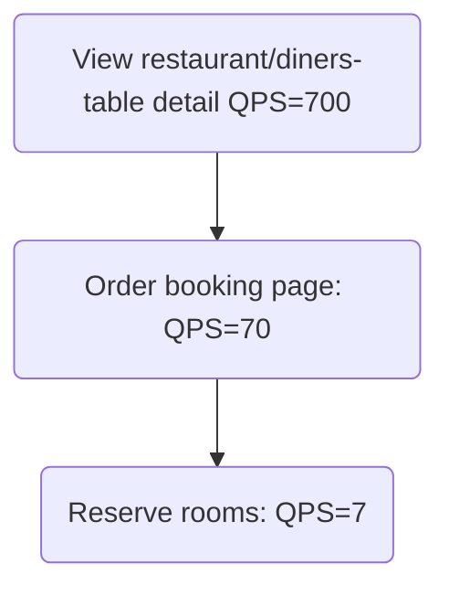
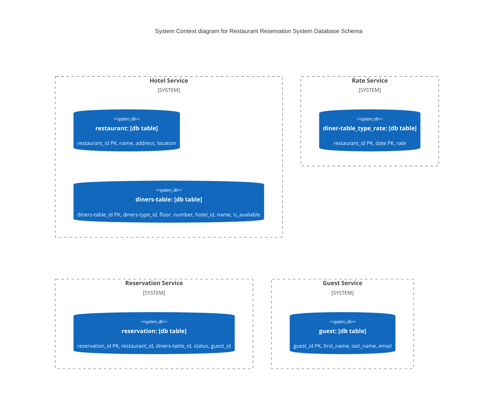
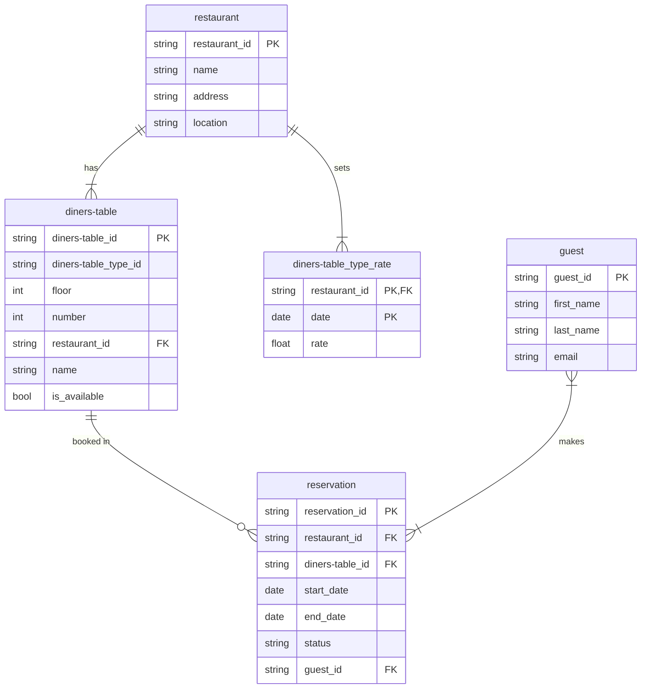
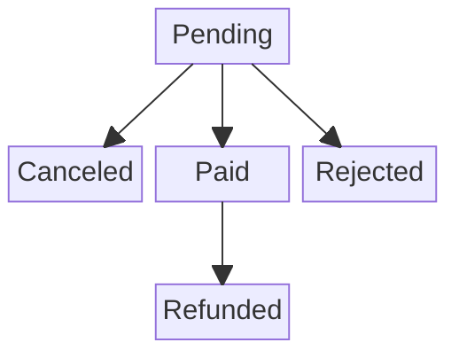

# Restaurant Reservation System Design
ref. ByteByteGo 23 Hotel Reservation System (modified for restaurant scenarios)

## Table of Contents
1. [Understand the Problem and Establish Design Scope](#step-1---understand-the-problem-and-establish-design-scope)
   - [Non-functional requirements](#non-functional-requirements)
   - [Back-of-the-envelope estimation](#back-of-the-envelope-estimation)
   - 
2. [Step 2 - Propose High-Level Design and Get Buy-In](#step-2---propose-high-level-design-and-get-buy-in)
   - [High-level design](#high-level-design)

4. [Node.js architecture](#nodejs-architecture)
   - [Synchronous Execution](#synchronous-execution)
   - [Asynchronous Execution](#asynchronous-execution)
5. [Why use Node.js?](#why-use-nodejs)
6. [Running Node.js and Writing Basic Scripts](#running-nodejs-and-writing-basic-scripts)
   - [Running a script with the node command](#running-a-script-with-the-node-command)


## Restaurant Reservation System
we design a restaurant reservation system for a restaurant chain such as Marriott International. The design and techniques used in this chapter are also applicable to other popular booking-related interview topics:
 * Design Airbnb
 * Design a flight reservation system
 * Design a movie ticket booking system

## Step 1 - Understand the Problem and Establish Design Scope
The restaurant reservation system is complicated and its components vary based on business use cases. Before diving into the design, you should ask question-&-answer clarification to narrow down the scope.

Question: What is the scale of the system?
Answer: Let’s assume we are building a website for a restaurant chain that has 29,000 restaurants and 1 million diners-tables in total.

Question: Do customers pay when they make reservations or when they arrive at the restaurant?
Answer: For simplicity, they pay in full when they make reservations.

Question: Do customers book restaurant diners-tables through the restaurant’s website only? Do we need to support other reservation options such as phone calls?
Answer: Let’s assume people could book a restaurant diners-table through the restaurant website or app.

Question: Can customers cancel their reservations?
Answer: Yes.

Question: Are there any other things we need to consider?
Answer: Yes, we allow 10% overbooking. In case you do not know, overbooking means the restaurant will sell more diners-tables than they actually have. Restaurants do this in anticipation that some customers will cancel their reservations.

Question: Since we have limited time, I assume the restaurant diners-table search is not within the scope. We focus on the following features:
 * Show the restaurant-related page.
 * Show the restaurant diners-table-related detail page.
 * Reserve a diners-table.
 * Admin panel to add/remove/update restaurant or diners-table info.
 * Support the overbooking feature.

Answer: Sounds good. One more thing, restaurant prices change dynamically. The price of a restaurant diners-table depends on how full the restaurant is expected to be on a given day. For this interview, we can assume the price could be different each day.
Question: I’ll keep this in mind.

Read More Here are the (6) six big problems that a restaurant reservation system can help you solve - https://www.touchbistro.com/blog/complete-guide-to-restaurant-reservations/#:~:text=kind%20of%20system.-,What%20Are%20Reservations?,seat%20at%20their%20favorite%20venue.

A reservation platform gives you the ability to communicate directly with customers by sending out automatic text and email reminders leading up to their reservation time. It’s a quick way to confirm, modify, or cancel a reservation – without you needing to pay for labor costs to call each reservation individually. Some reservations systems even allow you to go further and charge no-show fees for diners who skip out on their bookings. To read more on this feature, check out our reservations guide.
https://www.touchbistro.com/blog/restaurant-reservations-guide/

Next, you might want to talk about the most important non-functional requirements.

### Non-functional requirements
Support high concurrency. During peak season or big events, some popular restaurants may have a lot of customers trying to book the same diners-table.

Moderate latency. It’s ideal to have a fast response time when a user makes the reservation, but it’s acceptable if the system takes a few seconds to process a reservation request.

### Back-of-the-envelope estimation
* 29,000 restaurants and 1 million diners-tables in total.

* Assume 70% of the diners-tables are occupied and the average stay duration is 80 minutes.
> [!NOTE]
> This is a note with important information.
> Restaurants typically operate for 10 to 14 hours per day, with common schedules ranging from 11:00 AM to 9:00 PM or 11:00 PM to accommodate lunch and dinner. Breakfast-focused spots may open as early as 7:00 AM, while some, such as diners or specific fast-food chains, may operate 24 hours.

* Estimated daily reservations: (1 million * 0.7) = 700,000 -calculating based on The formula (diners-table * percentage of occupied diners-tables)

* Reservations per second = 700,000 / 10^5 seconds in a day = ~7. As we can see, the average reservation transaction per second (TPS) is not high. —measures the throughput of a booking system, website, or API within a specific timeframe.
> [!TIP]
> This is a helpful tip for doing things better or more easily.
> Detailed Breakdown:
>  * Numerator (700,000): Total daily reservations. This is calculated based on an assumed 1 million total diner-table available, with a (70%) occupancy rate, divided by an average stay of 3 days (1,000,000 * 0.7 / 1 =approx= ~700,000).
>  * Denominator (10^5): This represents (100,000) seconds, a rough estimate of the number of seconds in a day (specifically 24hrs * 60mins * 60secs / 1day =approx= ~86,400seconds per day, but (10^5) is used as a simplified, high-load engineering estimate.
>  * Result: 700,000 / 100,000 = ~7) requests per second (RPS). 

Next, let’s do a rough calculation of the QPS of all pages in the system. There are three steps in a typical customer flow:
 1. View restaurant/diners-table detail page. Users browse this page (query).
 2. View the booking page. Users can confirm the booking details, such as dates, number of guests, payment information before booking (query).
 3. Reserve a diners-table. Users click on the “book” button to book the diners-table and the diners-table is reserved (transaction).

Let’s assume around 10% of users reach the next step and 90% of users drop off the flow before reaching the final step. We can also assume that no prefetching feature (prefetching the content before the user reaches the next step) is implemented. Figure 1 shows a rough estimation of what the QPS looks like for different steps. We know the final reservation TPS is 7 so we can work backwards along the funnel. The QPS of the order confirmation page is 70 and the QPS for the detail page is 700.


Figure 1 QPS distribution

^ Image represents a funnel diagram illustrating the decreasing user traffic at each stage of an online restaurant booking system.  The diagram is structured as an inverted triangle, with three horizontal layers representing distinct stages of the booking process. The top layer, the widest part of the funnel, is labeled 'View restaurant/diners-table detail (QPS=700),' indicating that 700 queries per second (QPS) are directed towards viewing restaurant and diners-table details.  Below this, the second layer, narrower than the first, is labeled 'Order booking page (QPS=70),' showing a significant drop in traffic to 70 QPS at the order booking page. Finally, the narrowest layer at the bottom represents 'Reserve diners-tables (QPS=7),' indicating that only 7 QPS reach the final stage of diners-table reservation.  The decreasing QPS values across the layers visually represent the typical funnel effect where a large number of initial views result in a smaller number of completed bookings.

## Step 2 - Propose High-Level Design and Get Buy-In
In this section, we’ll discuss:
 * API design
 * Data models
 * High-level design

API design
We explore the API design for the restaurant reservation system. The most important APIs are listed below using the RESTful conventions.

Note that this chapter focuses on the design of a restaurant reservation system. For a complete restaurant website, the design needs to provide intuitive features for customers to search for diners-tables based on a large array of criteria. The APIs for these search features, while important, are not technically challenging. They are out of scope for this chapter.

Restaurant-related APIs:
| API | Detail |
|---|---|
| GET /v1/restaurants/ID | Get detailed information about a restaurant.|
| POST /v1/restaurants | Add a new restaurant. This API is only available to restaurant staff.
| PUT /v1/restaurants/ID | Update restaurant information. This API is only available to restaurant staff.|
| DELETE /v1/restaurants/ID | Delete a restaurant. This API is only available to restaurant staff.|
Table 1 Restaurant-related APIs

Diners-table-related APIs:
| API | Detail |
|---|---|
| GET /v1/restaurants/ID/diners-tables/ID | Get detailed information about a diners-table. |
| POST /v1/restaurants/ID/diners-tables | Add a diners-table. This API is only available to restaurant staff. |
| PUT /v1/restaurants/ID/diners-tables/ID | Update diners-table information. This API is only available to restaurant staff. |
| DELETE /v1/restaurants/ID/diners-tables/ID | Delete a diners-table. This API is only available to restaurant staff. |
Table 2 Diners-table-related APIs

Reservation related APIs:
| API | Detail |
|---|---|
| GET /v1/reservations | Get the reservation history of the logged-in user.
| GET /v1/reservations/ID | Get detailed information about a reservation.
| POST /v1/reservations | Make a new reservation.
| DELETE /v1/reservations/ID | Cancel a reservation.
Table 3 Reservation-related APIs

Making a new reservation is a very important feature. The request parameters of making a new reservation (POST /v1/reservations) could look like this.
```json
{
  "startDate":"2021-04-28",
  "endDate":"2021-04-30",
  "restaurantID":"245",
  "diners-tableID":"U12354673389",
  "reservationID":"13422445"
}
```

Please note reservationID is used as the idempotency key to prevent double booking. Double booking means multiple reservations are made for the same diners-table on the same day. The details are explained in “Concurrency issue” in the ‘Deep Dive’ section.

Data model
Before we decide which database to use, let’s take a close look at the data access patterns. For the restaurant reservation system, we need to support the following queries:
1. Query#1: View detailed information about a restaurant.
2. Query#2: Find available types of diners-tables given a date range.
3. Query#3: Record a reservation.
4. Query#4: Look up a reservation or past history of reservations.

From the back-of-the-envelope estimation, we know the scale of the system is not large but we need to prepare for traffic surges during big events. With these requirements in mind, we choose a relational database because:
 * A relational database works well with read-heavy and write less frequently workflows. This is because the number of users who visit the restaurant website/apps is a few orders of magnitude higher than those who actually make reservations. NoSQL databases are generally optimized for writes and the relational database works well enough for read-heavy workflow.
 * A relational database provides ACID (atomicity, consistency, isolation, durability) guarantees. ACID properties are important for a reservation system. Without those properties, it’s not easy to prevent problems such as negative balance, double charge, double reservations, etc. ACID properties make application code a lot simpler and make the whole system easier to reason about. A relational database usually provides these guarantees.
 * A relational database can easily model the data. The structure of the business data is very clear and the relationship between different entities (restaurant, diners-table, diners-table_type, etc) is stable. This kind of data model is easily modeled by a relational database.

Now that we have chosen the relational database as our data store, let’s explore the schema design. Figure 2 shows a straightforward schema design and it is the most natural way for many candidates to model the restaurant reservation system.

^ Image represents a database schema design for a restaurant reservation system, depicted using Entity-Relationship diagrams.  Four services are shown: 'Restaurant Service,' 'Rate Service,' 'Guest Service,' and 'Reservation Service.' Each service contains one table.  'Restaurant Service' has a `restaurant` table with attributes `restaurant_id` (primary key, PK), `name`, `address`, and `location`.  'Rate Service' has a `diners-table_type_rate` table with attributes `restaurant_id` (PK), `date` (PK), and `rate`. 'Guest Service' has a `guest` table with attributes `guest_id` (PK), `first_name`, `last_name`, and `email`. Finally, 'Reservation Service' has a `reservation` table with attributes `reservation_id` (PK), `restaurant_id`, `diners-table_id`, `start_date`, `end_date`, `status`, and `guest_id`.  The diagram illustrates a relational database structure where relationships between tables are implied through shared attribute names like `restaurant_id`, `diners-table_id`, and `guest_id`, suggesting foreign key relationships that would need to be explicitly defined in a real database implementation.  No explicit connections are drawn between the tables, but the shared attributes indicate the relationships.

Figure 2 Database schema

Most attributes are self-explanatory and we will only explain the status field in the reservation table. The status field can be in one of these states: pending, paid, refunded, canceled, rejected. The state machine is shown in Figure 3.


Figure 3 Reservation status

^ Image represents a state diagram illustrating the lifecycle of a payment.  The diagram shows a central 'Pending' state, which acts as the starting point.  From the 'Pending' state, a payment can transition to one of three states: 'Canceled,' 'Paid,' or 'Rejected.'  The 'Canceled' state represents a payment that has been terminated before processing. The 'Paid' state indicates a successful payment.  From the 'Paid' state, there's a further transition to a 'Refunded' state, suggesting a subsequent refund process.  Arrows indicate the direction of state transitions, showing the possible flow of a payment through its lifecycle.  There are no URLs, parameters, or other textual information besides the state names within the boxes.

This schema design has a major issue. This data model works for companies like Airbnb as diners-table_id (might be called listing_id) is given when users make reservations. However, this isn’t the case for restaurants. A user actually reserves a type of diners-table in a given restaurant instead of a specific diners-table. For instance, a diners-table type can be a standard diners-table, king-size diners-table, queen-size diners-table with two queen beds, etc. Diners-table numbers are given when the guest checks in and not at the time of the reservation. We need to update our data model to reflect this new requirement. See “Improved data model” in the ‘Deep Dive’ section for more details.

### High-level design
We use the microservice architecture for this restaurant reservation system. Over the past few years, microservice architecture has gained great popularity. Companies that use microservice include Amazon, Netflix, Uber, Airbnb, Twitter, etc. If you want to learn more about the benefits of a microservice architecture, you can check out some good resources [1] [2].

Our design is modeled with the microservice architecture and the high-level design diagram is shown in Figure 4.

Image represents a system architecture diagram for a restaurant booking system.  The diagram is divided into external and internal sections, separated by a horizontal line.  On the external side, a user's mobile device interacts with a CDN (Content Delivery Network), which then connects to a 'Public API Gateway.' This gateway acts as a central point, distributing requests to four distinct services: 'Restaurant Service,' 'Rate Service,' 'Reservation Service,' and 'Payment Service.' Each of these services interacts with its own database ('Restaurant DB,' 'Rate DB,' 'Reservation DB,' and 'Payment DB,' respectively).  The 'Restaurant Service' also utilizes a 'Restaurant Cache' for improved performance. On the internal, private side, an 'Admin' user interacts with an 'Internal API,' which in turn connects to a 'Restaurant Management Service.'  The arrows indicate the flow of information and requests between components.  The system is designed to handle user requests for restaurant information, rates, reservations, and payments, while also providing an administrative interface for managing the restaurant data.
Figure 4 High-level design
We will briefly go over each component of the system from top to bottom.

User: a user books a restaurant diners-table on their mobile phone or computer.

Admin (restaurant staff): authorized restaurant staff perform administrative operations such as refunding a customer, canceling a reservation, updating diners-table information, etc.

CDN (content delivery network): for better load time, CDN is used to cache all static assets, including JavaScript bundles, images, videos, HTML, etc.

Public API Gateway: this is a fully managed service that supports rate limiting, authentication, etc. The API gateway is configured to direct requests to specific services based on the endpoints. For example, requests to load the restaurant homepage are directed to the restaurant service and requests to book a restaurant diners-table are routed to the reservation service.

Internal APIs: those APIs are only available to authorized restaurant staff. They are accessible through internal software or websites. They are usually further protected by a VPN (virtual private network).

Restaurant Service: this provides detailed information on restaurants and diners-tables. Restaurant and diners-table data are generally static, so can be easily cached.

Rate Service: this provides diners-table rates for different future dates. An interesting fact about the restaurant industry is that the price of a diners-table depends on how full the restaurant is expected to be on a given day.

Reservation Service: receives reservation requests and reserves the restaurant diners-tables. This service also tracks diners-table inventory as diners-tables are reserved or reservations are canceled.

Payment Service: executes payment from a customer and updates the reservation status to “paid” once a payment transaction succeeds, or “rejected” if the transaction fails.

Restaurant Management Service: only available to authorized restaurant staff. Restaurant staff are eligible to use the following features: view the record of an upcoming reservation, reserve a diners-table for a customer, cancel a reservation, etc.

For clarity, Figure 4 omits many arrows of interactions between microservices. For example, as shown in Figure 5, there should be an arrow between Reservation service and Rate service. Reservation service queries Rate service for diners-table rates. This is used to compute the total diners-table charge for a reservation. Another example is that there should be many arrows connecting the Restaurant Management Service with most of the other services. When an admin makes changes via Restaurant Management Service, the requests are forwarded to the actual service owning the data, to handle the changes.

Image represents two distinct service architectures.  The left side shows a simple, two-service architecture where a 'Reservation Service' directly calls upon a 'Rate Service' for information, indicated by a downward-pointing arrow connecting the two rectangular boxes representing the services. The right side depicts a more complex, microservices-based architecture. A central 'Restaurant Management Service' acts as an orchestrator, distributing requests to various subordinate services.  Arrows point from the 'Restaurant Management Service' to four other services: 'Restaurant Service,' 'Rate Service,' 'Reservation Service,' and an ellipsis (...) representing additional unspecified services. This illustrates a client-server relationship where the 'Restaurant Management Service' acts as a central point of control, delegating tasks to specialized services, unlike the simpler direct interaction shown on the left.  The diagram highlights the difference between a monolithic (left) and a microservices (right) approach to system design.
Figure 5 Connections between services
For production systems, inter-service communication often employs a modern and high-performance remote procedure call (RPC) framework like gPRC. There are many benefits to using such frameworks. To learn more about gPRC in particular, check out [3].

Step 3 - Design Deep Dive
Now we’ve talked about the high-level design, let’s go deeper into the following.

Improved data model

Concurrency issues

Scaling the system

Resolving data inconsistency in the microservice architecture

Improved data model
As mentioned in the high-level design, when we reserve a restaurant diners-table, we actually reserve a type of diners-table, as opposed to a specific diners-table. What do we need to change about the API and schema to accommodate this?

For the reservation API, diners-tableID is replaced by diners-tableTypeID in the request parameter. The API to make a reservation looks like this:

POST /v1/reservations
Request parameters:

{
  "startDate":"2021-04-28",
  "endDate":"2021-04-30",
  "restaurantID":"245",
  "diners-tableTypeID":"12354673389",
  "diners-tableCount":"3",
  "reservationID":"13422445"
}
The updated schema is shown in Figure 6.

Image represents a database schema design for a restaurant reservation system, divided into four logical services: Restaurant Service, Rate Service, Guest Service, and Reservation Service.  Each service is depicted as a dashed-line box containing one or more database tables. The Restaurant Service contains `restaurant` (with attributes `restaurant_id` (PK), `name`, `address`, `location`) and `diners-table` tables (with attributes `diners-table_id` (PK), `diners-table_type_id`, `floor`, `number`, `restaurant_id`, `name`, `is_available`). The Rate Service includes the `diners-table_type_rate` table (with attributes `restaurant_id` (PK), `date` (PK), `rate`). The Guest Service has the `guest` table (with attributes `guest_id` (PK), `first_name`, `last_name`, `email`). Finally, the Reservation Service comprises `diners-table_type_inventory` (with attributes `restaurant_id`, `diners-table_type_id`, `date`, `total_inventory`, `total_reserved`) and `reservation` tables (with attributes `reservation_id` (PK), `restaurant_id`, `diners-table_type_id`, `start_date`, `end_date`, `status`, `guest_id`).  The `PK` label indicates primary keys.  Relationships between tables are implied through shared attribute names like `restaurant_id`, `diners-table_type_id`, and `guest_id`, suggesting foreign key relationships, although these are not explicitly shown.
Figure 6 Updated schema
We’ll briefly go over some of the most important tables.

diners-table: contains information about a diners-table.

diners-table_type_rate: stores price data for a specific diners-table type, for future dates.

reservation: records guest reservation data.

diners-table_type_inventory: stores inventory data about restaurant diners-tables. This table is very important for the reservation system, so let’s take a close look at each column.

restaurant_id: ID of the restaurant

diners-table_type_id: ID of a diners-table type.

date: a single date.

total_inventory: the total number of diners-tables minus those that are temporarily taken off the inventory. Some diners-tables might be taken off the market for maintenance.

totalreserved: the total number of diners-tables booked for the specified _restaurant_id, diners-table_type_id, and date.

There are other ways to design the diners-table_type_inventory table, but having one row per date makes managing reservations within a date range and queries easy. As shown in Figure 6, (restaurant_id, diners-table_type_id, date) is the composite primary key. The rows of the table are pre-populated by querying the inventory data across all future dates within 2 years. We have a scheduled daily job that pre-populates inventory data when the dates advance further.

Now that we’ve finalized the schema design, let’s do some estimation about the storage volume. As mentioned in the back-of-the-envelope estimation, we have 5,000 restaurants. Assume each restaurant has 20 types of diners-tables. That’s (29,000 restaurants * 20 types of diners-tables* 2 years * 365 days) = 73 million rows. 73 million is not a lot of data and a single database is enough to store the data. However, a single server means a single point of failure. To achieve high availability, we could set up database replications across multiple regions or availability zones.

Table 4 shows the sample data of the “diners-table_type_inventory” table.

restaurant_id	diners-table_type_id	date	total_inventory	total_reserved
211	1001	2021-06-01	100	80
211	1001	2021-06-02	100	82
211	1001	2021-06-03	100	86
211	1001	...	...	
211	1001	2023-05-31	100	0
211	1002	2021-06-01	200	16
2210	101	2021-06-01	30	23
2210	101	2021-06-02	30	25
Table 4 Sample data of the “diners-table_type_inventory” table


The diners-table_type_inventory table is utilized to check if a customer can reserve a specific type of diners-table or not. The input and output for a reservation might look like this:

Input: startDate (2021-07-01), endDate (2021-07-03), diners-tableTypeId, restaurantId, numberOfDiners-tablesToReserve

Output: True if the specified type of diners-table has inventory and users can book it. Otherwise, it returns false.

From the SQL perspective, it contains the following two steps:

Select rows within a date range

SELECT date, total_inventory, total_reserved
FROM diners-table_type_inventory
WHERE diners-table_type_id = ${diners-tableTypeId} AND restaurant_id = ${restaurantId}
AND date between ${startDate} and ${endDate}
This query returns data like this:

date	total_inventory	total_reserved
2021-07-01	100	97
2021-07-02	100	96
2021-07-03	100	95
Table 5 Restaurant inventory

For each entry, the application checks the condition below:

if (total_reserved + ${numberOfDiners-tablesToReserve}) <= total_inventory
If the condition returns true for all entries, it means there are enough diners-tables for each date within the date range.

One of the requirements is to support 10% overbooking. With the new schema, it is easy to implement:

if (total_reserved + ${numberOfDiners-tablesToReserve}) <= 110% * total_inventory
At this point, the interviewer might ask a follow-up question: “if the reservation data is too large for a single database, what would you do?” There are a few strategies:

Store only current and future reservation data. Reservation history is not frequently accessed. So they can be archived and some can even be moved to cold storage.

Database sharding. The most frequent queries include making a reservation or looking up a reservation by name. In both queries, we need to choose the restaurant first, meaning restaurant_id is a good sharding key. The data can be sharded by hash(restaurant_id) % number_of_servers.

Concurrency issues
Another important problem to look at is double booking. We need to solve two problems: 1) the same user clicks on the “book” button multiple times. 2) multiple users try to book the same diners-table at the same time.

Let’s take a look at the first scenario. As shown in Figure 7, two reservations are made.

Image represents a simplified system design illustrating two consecutive user actions and their impact on a database.  The diagram shows two user icons, labeled 'User's first click' and 'User's second click,' each connected to a 'INSERT INTO RESERVATION' box.  Each box contains an SQL-like `INSERT` statement with identical parameters: `121`, `2`, `3`, `2021-06-01`, `2021-06-04`, `pending_pay`, and `guest1`, representing data for a reservation (restaurant ID, diners-table type ID, etc.).  Both `INSERT` boxes have arrows pointing downwards to a dashed-line box labeled 'row 1:' and 'row 2:', showing the same data as inserted, implying the creation of two identical rows in the database.  To the right, a table labeled 'reservation' is depicted, outlining the database schema with columns: `reservation_id`, `restaurant_id`, `diners-table_type_id`, `start_date`, `end_date`, `status`, and `guest_id`, suggesting the destination of the inserted data.  The diagram visually demonstrates a potential concurrency issue where two identical reservations are created due to two consecutive clicks.
Figure 7 Two reservations are made
There are two common approaches to solve this problem:

Client-side implementation. A client can gray out, hide or disable the “submit” button once a request is sent. This should prevent the double-clicking issue most of the time. However, this approach is not very reliable. For example, users can disable JavaScript, thereby bypassing the client check.

Idempotent APIs. Add an idempotency key in the reservation API request. An API call is idempotent if it produces the same result no matter how many times it is called. Figure 8 shows how to use the idempotency key (reservation_id) to avoid the double-reservation issue. The detailed steps are explained below.

Image represents a sequence diagram illustrating the interaction between a User and a Reservation Service.  The diagram shows a User initiating a reservation process.  First, the User sends a 'Generate reservation order' request (step 1) to the Reservation Service, which then responds (step 2) by sending back a 'Show reservation page' message containing a unique `reservation_id`. The User then attempts to submit the reservation twice (steps 3a and 3b), both times sending the `reservation_id`. The first submission (3a) is successful, but the second submission (3b) fails, indicated by a red 'X', because a 'Unique constraint is violated' error message appears, specifying that the `reservation_id` is already in use.  The diagram uses numbered steps to show the order of events and dashed lines to represent asynchronous communication between the User and the Reservation Service.  The Reservation Service is depicted as a rectangle, and the User is represented by a stick figure.
Figure 8 Unique constraint
1. Generate a reservation order. After a customer enters detailed information about the reservation (diners-table type, check-in date, check-out date, etc) and clicks the “continue” button, a reservation order is generated by the reservation service.

2. The system generates a reservation order for the customer to review. The unique reservation_id is generated by a globally unique ID generator and returned as part of the API response. The UI of this step might look like this:

Image represents a Booking.com webpage displaying the final steps of a restaurant booking for Alex. The top displays the Booking.com logo and a three-step progress bar labeled 'Your Selection' (checked), 'Your Details' (checked), and 'Final Step' (unchecked). Below, a message confirms the booking is almost complete. The booking details include the restaurant, 'San Francisco Marriott Marquis Union Square,' designated as a 4-star restaurant with a thumbs-up icon; check-in date (Wed, Jul 7, 2021) and check-out date (Sat, Jul 10, 2021); a summary of 3 nights in a King Diners-table with No View; and a breakdown of the total cost, including the diners-table price ($508), 14% TAX ($71.12), a tourism fee $2.19, and 2.25% City tax $11.43. A section for payment details requires a card number (with a credit card icon), cardholder's name (Alex is pre-filled), and expiration date (MM/YY format). A checkbox indicates that no charge will be made, only a hold on the card to secure the diners-table. Finally, a blue button labeled 'Complete my booking >' allows the user to finalize the booking. A 'Change dates' link is also present to modify the booking dates.
Figure 9 Confirmation page (Source: [4])
3a. Submit reservation 1. The reservation_id is included as part of the request. It is the primary key of the reservation table (Figure 6). Please note that the idempotency key doesn’t have to be the reservation_id. We choose reservation_id because it already exists and works well for our design.

3b. If a user clicks the “Complete my booking” button a second time, reservation 2 is submitted. Because reservation_id is the primary key of the reservation table, we can rely on the unique constraint of the key to ensure no double reservation happens.

Figure 10 explains why double reservation can be avoided.

Image represents a system design diagram illustrating a database insertion scenario with a unique constraint violation.  The diagram shows two user clicks, each initiating an `INSERT INTO RESERVATION` SQL query.  The first query, triggered by the 'User's first click,' attempts to insert a new reservation with values: `121` (highlighted in orange), `2`, `3`, `2021-06-01`, `2021-06-04`, `pending_pay`, and `guest1`. This results in a successful insertion, indicated by a blue checkmark and a new row added to the database, shown as `row 1: 121, 2, 3, 2021-06-01, 2021-06-04, pending_pay, guest1`. The second query, initiated by 'User's second click,' attempts to insert the exact same data.  However, this leads to a 'Unique constraint violation' because the `reservation_id` (121) is already present in the `reservation` table (a table schema is shown on the right, detailing its columns: `reservation_id`, `restaurant_id`, `diners-table_type_id`, `start_date`, `end_date`, `status`, and `guest_id`). This failure is represented by a red 'X'.  A dashed line connects the second query to the 'Unique constraint violation' text, visually linking the failed insertion attempt to the constraint violation.  The `reservation_id` (121) is highlighted in orange in both queries to emphasize its role in the constraint violation.
Figure 10 Unique constraint violation
Scenario 2: what happens if multiple users book the same type of diners-table at the same time when there is only one diners-table left? Let’s consider the scenario as shown in Figure 11.

Image represents a sequence diagram illustrating a race condition in a diners-table reservation system.  Two users (User 1 and User 2) concurrently attempt to reserve the last available diners-table.  Initially, both users see that `total_inventory = 100` and `total_reserved = 99`, indicating one diners-table is left (steps 1).  Both users proceed to check the diners-table inventory (steps 2 and 3), confirming one diners-table's availability. Subsequently, both users attempt to reserve the diners-table (steps 4 and 5), incrementing `total_reserved` by one.  Crucially, this increment happens independently and without locking, leading to a race condition.  Both users then commit their reservations (steps 6 and 7), resulting in `total_reserved = 100` for both users, even though only one diners-table was available.  The diagram uses numbered steps to show the sequence of events, boxes to display initial and final inventory states, and arrows to indicate the flow of actions between users and the system.  The checkmarks next to steps 6 and 7 signify successful commit operations, highlighting the problematic outcome where both reservations are accepted despite the limited inventory.  A vertical 'Time' axis implicitly shows the concurrent nature of the actions.
Figure 11 Race condition
Let’s assume the database isolation level is not serializable [5]. User 1 and User 2 try to book the same type of diners-table at the same time, but there is only 1 diners-table left. Let’s call User 1’s execution ‘transaction 1’ and User 2’s execution ‘transaction 2.’ At this time, there are 100 diners-tables in the restaurant and 99 of them are reserved.

Transaction 2 checks if there are enough diners-tables left by checking if (total_reserved + diners-tables_to_book) <= total_inventory. Since there is 1 diners-table left, it returns true.

Transaction 1 checks if there are enough diners-tables by checking if (total_reserved + diners-tables_to_book) <= total_inventory. Since there is 1 diners-table left, it also returns true.

Transaction 1 reserves the diners-table and updates the inventory: reserved_diners-table becomes 100.

Then transaction 2 reserves the diners-table. The isolation property in ACID means database transactions must complete their tasks independently from other transactions. So data changes made by transaction 1 are not visible to transaction 2 until transaction 1 is completed (committed). So transaction 2 still sees total_reserved as 99 and reserves the diners-table by updating the inventory: reserved_diners-table becomes 100. This results in the system allowing both users to book a diners-table, even though there is only 1 diners-table left.

Transaction 1 successfully commits the change.

Transaction 2 successfully commits the change.

The solution to this problem generally requires some form of locking mechanism. We explore the following techniques:

Pessimistic locking

Optimistic locking

Database constraints

Before jumping into a fix, let’s take a look at the SQL pseudo-code utilized to reserve a diners-table. The SQL has two parts:

Check diners-table inventory

Reserve a diners-table

# step 1: check diners-table inventory
SELECT date, total_inventory, total_reserved
FROM diners-table_type_inventory
WHERE diners-table_type_id = ${diners-tableTypeId} AND restaurant_id = ${restaurantId}
AND date between ${startDate} and ${endDate}

# For every entry returned from step 1
if((total_reserved + ${numberOfDiners-tablesToReserve}) > 110% * total_inventory) {
  Rollback
}

# step 2: reserve diners-tables
UPDATE diners-table_type_inventory
SET total_reserved = total_reserved + ${numberOfDiners-tablesToReserve}
WHERE diners-table_type_id = ${diners-tableTypeId}
AND date between ${startDate} and ${endDate}

Commit
Option 1: Pessimistic locking
Pessimistic locking [6], also called pessimistic concurrency control, prevents simultaneous updates by placing a lock on a record as soon as one user starts to update it. Other users who attempt to update the record have to wait until the first user has released the lock (committed the changes).

For MySQL, the “SELECT ... FOR UPDATE'' statement works by locking the rows returned by a selection query. Let’s assume a transaction is started by “transaction 1”. Other transactions have to wait for transaction 1 to finish before beginning another transaction. A detailed explanation is shown in Figure 12.

Image represents a concurrency control scenario in a database system, illustrating how transactions handle simultaneous access to shared resources.  The diagram shows two users, User 1 and User 2, each initiating a transaction. User 1's Transaction 1 begins with `BEGIN TRANSACTION`, followed by a `SELECT ... FOR UPDATE` query to check diners-table inventory, then an `UPDATE` query to reserve a diners-table, and finally `COMMIT TRANSACTION`.  Simultaneously, User 2's Transaction 2 starts with `BEGIN TRANSACTION` and also attempts to check diners-table inventory using `SELECT ... FOR UPDATE`. However, because Transaction 1 holds a lock on the diners-table inventory due to the `SELECT ... FOR UPDATE`, Transaction 2 waits (`Transaction 2 waits for Transaction 1 to finish`). After Transaction 1 commits, Transaction 2 proceeds with its `# reserve diners-table` operation.  Since the diners-table is already reserved (implied by 'Total reserved = 100, cannot reserve diners-table'), Transaction 2 executes `ROLLBACK TRANSACTION`, indicating that the transaction failed and its changes were not persisted.  The vertical arrows represent the progression of time, showing the sequential steps within each transaction and the waiting period for Transaction 2.  The horizontal lines represent the synchronization point where Transaction 2 waits for Transaction 1 to complete before continuing.
Figure 12 Pessimistic locking
In Figure 12, the “SELECT ... FOR UPDATE” statement of transaction 2 waits for transaction 1 to finish because transaction 1 locks the rows. After transaction 1 finishes, total_reserved becomes 100, which means there is no diners-table for user 2 to book.

Pros:

Prevents applications from updating data that is being – or has been – changed.

It is easy to implement and it avoids conflict by serializing updates. Pessimistic locking is useful when data contention is heavy.

Cons:

Deadlocks may occur when multiple resources are locked. Writing deadlock-free application code could be challenging.

This approach is not scalable. If a transaction is locked for too long, other transactions cannot access the resource. This has a significant impact on database performance, especially when transactions are long-lived or involve a lot of entities.

Due to these limitations, we do not recommend pessimistic locking for the reservation system.

Option 2: Optimistic locking
Optimistic locking [7], also referred to as optimistic concurrency control, allows multiple concurrent users to attempt to update the same resource.

There are two common ways to implement optimistic locking: version number and timestamp. Version number is generally considered to be a better option because the server clock can be inaccurate over time. We explain how optimistic locking works with version number.

Figure 13 shows a successful case and a failure case.

Image represents a comparison of two scenarios illustrating data versioning and conflict resolution in a system.  The left side depicts a scenario with no conflict. It shows a linear progression: User 1 reads version 1 (v1) and then writes version 2 (v2). Subsequently, User 2 reads v2 and writes version 3 (v3).  All actions are sequential, represented by directed arrows connecting circular nodes (v1, v2, v3) representing data versions.  User 1 and User 2 are represented by person icons, with labels indicating their actions (Read v1, Write v2, Read v2, Write v3). A checkmark next to 'No conflict' indicates the successful, conflict-free execution. The right side shows a conflict scenario.  Here, User 1 and User 2 both write to v2 concurrently. User 1 reads v1 and writes v2, while User 2 also reads v1 and writes v2. This simultaneous write to v2 is indicated by a dashed curved arrow labeled 'Conflict' connecting the two v2 nodes.  The resulting v2 versions are distinct, leading to a conflict. A red 'X' next to 'Conflict' highlights the resulting data inconsistency.  Both diagrams use the same basic structure of user icons, version nodes (v1, v2, v3), and arrows to represent data flow and actions.
Figure 13 Optimistic locking
A new column called “version” is added to the database table.

Before a user modifies a database row, the application reads the version number of the row.

When the user updates the row, the application increases the version number by 1 and writes it back to the database.

A database validation check is put in place; the next version number should exceed the current version number by 1. The transaction aborts if the validation fails and the user tries again from step 2.

Optimistic locking is usually faster than pessimistic locking because we do not lock the database. However, the performance of optimistic locking drops dramatically when concurrency is high.

To understand why, consider the case when many clients try to reserve a restaurant diners-table at the same time. Because there is no limit on how many clients can read the available diners-table count, all of them read back the same available diners-table count and the current version number. When different clients make reservations and write back the results to the database, only one of them will succeed, and the rest of the clients receive a version check failure message. These clients have to retry. In the subsequent round of retries, there is only one successful client again, and the rest have to retry. Although the end result is correct, repeated retries cause a very unpleasant user experience.

Pros:

It prevents applications from editing stale data.

We don’t need to lock the database resource. There's actually no locking from the database point of view. It's entirely up to the application to handle the logic with the version number.

Optimistic locking is generally used when the data contention is low. When conflicts are rare, transactions can complete without the expense of managing locks.

Cons:

Performance is poor when data contention is heavy.
Optimistic locking is a good option for a restaurant reservation system since the QPS for reservations is usually not high.

Option 3: Database constraints
This approach is very similar to optimistic locking. Let’s explore how it works. In the diners-table_type_inventory table, add the following constraint:

CONSTRAINT `check_diners-table_count` CHECK((`total_inventory - total_reserved` >= 0))
Using the same example as shown in Figure 14, when user 2 tries to reserve a diners-table, total_reserved becomes 101, which violates the total_inventory (100) - total_reserved (101) >= 0 constraint. The transaction is then rolled back.

Image represents a sequence diagram illustrating a race condition in a diners-table reservation system.  Two users (User 1 and User 2) concurrently attempt to reserve the last available diners-table.  Initially, both users see that `total_inventory = 100` and `total_reserved = 99`, indicating one diners-table is left (steps 1).  Both users proceed to check the diners-table inventory (steps 2 and 3), confirming one diners-table's availability.  User 1 then reserves the diners-table, incrementing `total_reserved` (step 4) and successfully commits the reservation (step 5, indicated by a blue checkmark).  Simultaneously, User 2 also attempts to reserve the diners-table (step 6), also incrementing `total_reserved`. However, this action results in a constraint violation because `total_inventory - total_reserved` becomes negative (indicated by a red 'X'), demonstrating the race condition where the system's constraint is violated due to concurrent access without proper locking mechanisms.  The diagram uses numbered steps to show the sequence of events and clearly shows the final state where the constraint `total_inventory - total_reserved >= 0` is violated. A vertical Time axis is shown on the left.
Figure 14 Database constraint
Pros

Easy to implement.

It works well when data contention is minimal.

Cons

Similar to optimistic locking, when data contention is heavy, it can result in a high volume of failures. Users could see there are diners-tables available, but when they try to book one, they get the “no diners-tables available” response. This experience can be frustrating to users.

The database constraints cannot be version-controlled easily like the application code.

Not all databases support constraints. It might cause problems when we migrate from one database solution to another.

Since this approach is easy to implement and the data contention for a restaurant reservation is usually not high (low QPS), it is another good option for the restaurant reservation system.

Scalability
Usually, the load of the restaurant reservation system is not high. However, the interviewer might have a follow-up question: “what if the restaurant reservation system is used not just for a restaurant chain, but for a popular travel site such as booking.com or expedia.com?” In this case, the QPS could be 1,000 times higher.

When the system load is high, we need to understand what might become the bottleneck. All our services are stateless, so they can be easily expanded by adding more servers. However, the database contains all the states and cannot be scaled up by simply adding more databases. Let’s explore how to scale the database.

Database sharding
One way to scale the database is to apply database sharding. The idea is to split the data into multiple databases so that each of them only contains a portion of data.

When we shard a database, we need to consider how to distribute the data. As we can see from the data model section, most queries need to filter by restaurant_id. So a natural conclusion is we shard data by restaurant_id. In Figure 15, the load is spread among 16 shards. Assume the QPS is 30,000. After database sharding, each shard handles 30,000 / 16 = 1875 QPS, which is within a single MySQL server’s load capacity.

Image represents a database sharding scheme.  A central 'Reservation Service' component sends requests to sixteen different database shards (labeled 'Shard 0' through 'Shard 15'). The routing logic is based on the modulo operator:  `restaurant_id % 16`. This means the `restaurant_id` is used as input to the modulo operation with 16 as the divisor. The remainder of this operation determines which shard receives the request. For example, if `restaurant_id` is 17, the remainder is 1, and the request goes to 'Shard 1'.  Each shard is depicted as a cylindrical database icon, implying that each shard stores a subset of the overall restaurant reservation data.  The arrows indicate the flow of requests from the Reservation Service to the appropriate shard based on the `restaurant_id` calculation.
Figure 15 Database sharding
Caching
The restaurant inventory data has an interesting characteristic; only current and future restaurant inventory data are meaningful because customers can only book diners-tables in the near future.

So for the storage choice, ideally we want to have a time-to-live (TTL) mechanism to expire old data automatically. Historical data can be queried on a different database. Redis is a good choice because TTL and Least Recently Used (LRU) cache eviction policy help us make optimal use of memory.

If the loading speed and database scalability become issues (for instance, we are designing at booking.com or expedia.com’s scale), we can add a cache layer on top of the database and move the check diners-table inventory and reserve diners-table logic to the cache layer, as shown in Figure 16. In this design, only a small percentage of the requests hit the inventory database as most ineligible requests are blocked by the inventory cache. One thing worth mentioning is that even when there is enough inventory shown in Redis, we still need to recheck the inventory at the database side as a precaution. The database is the source of truth for the inventory data.

Image represents a simplified architecture diagram for a reservation service.  At the top, a 'Reservation Service' box acts as the central component.  This service branches into two functional boxes: 'Query inventory' and 'Update inventory.'  The 'Query inventory' box is connected to a stylized red database icon representing a cache layer.  The 'Update inventory' box connects to both an 'Async update cache' box and a database cylinder labeled 'Shard 15,' indicating a specific database shard.  The 'Async update cache' box suggests that updates to the cache are handled asynchronously, implying a non-blocking operation that doesn't impede the main reservation service's response time.  The overall flow shows that the reservation service queries inventory from the cache and updates inventory by writing to both the cache (asynchronously) and the persistent database (Shard 15).
Figure 16 Caching
Let’s first go over each component in this system.

Reservation service: supports the following inventory management APIs:

Query the number of available diners-tables for a given restaurant ID, diners-table type, and date range.

Reserve a diners-table by executing total_reserved + 1.

Update inventory when a user cancels a reservation.

Inventory cache: all inventory management query operations are moved to the inventory cache (Redis) and we need to pre-populate inventory data to the cache. The cache is a key-value store with the following structure:

key: restaurantID_diners-tableTypeID_{date}
value: the number of available diners-tables for the given restaurant ID, diners-table type ID and date.
For a restaurant reservation system, the volume of read operations (check diners-table inventory) is an order of magnitude higher than write operations. Most of the read operations are answered by the cache.

Inventory DB: stores inventory data as the source of truth.

New challenges posed by the cache

Adding a cache layer significantly increases the system scalability and throughput, but it also introduces a new challenge: how to maintain data consistency between the database and the cache.

When a user books a diners-table, two operations are executed in the happy path:

Query diners-table inventory to find out if there are enough diners-tables left. The query runs on the Inventory cache.

Update inventory data. The inventory DB is updated first. The change is then propagated to the cache asynchronously. This asynchronous cache update could be invoked by the application code, which updates the inventory cache after data is saved to the database. It could also be propagated using change data capture (CDC) [8]. CDC is a mechanism that reads data changes from the database and applies the changes to another data system. One common solution is Debezium [9]. It uses a source connector to read changes from a database and applies them to cache solutions such as Redis [10].

Because the inventory data is updated on the database first, there is a possibility that the cache does not reflect the latest inventory data. For example, the cache may report there is still an empty diners-table when the database says there is no diners-table left, or vice versa.

If you think carefully, you find that the inconsistency between inventory cache and database actually does not matter, as long as the database does the final inventory validation check.

Let’s take a look at an example. Let’s say the cache states there is still an empty diners-table, but the database says there is not. In this case, when the user queries the diners-table inventory, they find there is still diners-table available, so they try to reserve it. When the request reaches the inventory database, the database does the validation and finds that there is no diners-table left. In this case, the client receives an error, indicating someone else just booked the last diners-table before them. When a user refreshes the website, they probably see there is no diners-table left because the database has synchronized inventory data to the cache, before they click the refresh button.

Pros

Reduced database load. Since read queries are answered by the cache layer, database load is significantly reduced.

High performance. Read queries are very fast because results are fetched from memory.

Cons

Maintaining data consistency between the database and cache is hard. We need to think carefully about how this inconsistency affects user experience.
Data consistency among services
In a traditional monolithic architecture [11], a shared relational database is used to ensure data consistency. In our microservice design, we chose a hybrid approach by having Reservation Service handle both reservation and inventory APIs, so that the inventory and reservation database tables are stored in the same relational database. As explained in the “Concurrency Issues” section, this arrangement allows us to leverage the ACID properties of the relational database to elegantly handle many concurrency issues that arise during the reservation flow.

However, if your interviewer is a microservice purist, they might challenge this hybrid approach. In their mind, for a microservice architecture, each microservice has its own databases, as shown on the right in Figure 17.

Image represents a comparison of monolithic and microservice architectures for a restaurant booking system.  The left side depicts a monolithic architecture where three services—Reservation Service, Inventory Service, and Payment Service—all interact with a single, centralized database labeled 'Restaurant DB.'  Arrows indicate data flow from each service to the shared database.  The right side shows a microservice architecture.  Here, each service (Reservation Service, Inventory Service, and Payment Service) has its own dedicated database: Reservation DB, Inventory DB, and Payment DB, respectively.  Arrows illustrate that each service interacts exclusively with its corresponding database, promoting independent scaling and deployment.  The key difference is the centralized database in the monolithic architecture versus the decentralized, service-specific databases in the microservice architecture.
Figure 17 Monolithic vs microservice
This pure design introduces many data consistency issues. Since this is the first time we cover microservices, let’s explain how and why it happens. To make it easier to understand, only two services are used in this discussion. In the real world, there could be hundreds of microservices within a company. In a monolithic architecture, as shown in Figure 18, different operations can be wrapped within a single transaction to ensure ACID properties.

Image represents a sequence diagram illustrating the interaction between a User and a Database for diners-table reservation.  The diagram shows a User represented by a stick figure on the left, connected via solid lines to a Database represented by a cylinder on the right.  The interaction is depicted using horizontal arrows. The User initiates two actions: 'Manage diners-table inventory,' sending a request to the Database, which processes it (represented by a vertical activation bar) and sends a response back to the User via a dashed arrow.  Similarly, the User initiates a 'Reserve diners-table' request, which is processed by the Database, and a response is returned.  A vertical arrow labeled 'Single Transaction' connects the Database's processing of both requests, indicating that both actions are part of a single database transaction, ensuring atomicity and consistency.  The dashed lines connecting the Database to its representation suggest a loose coupling, implying that the Database might be a separate service.
Figure 18 Monolithic architecture
However, in a microservice architecture, each service has its own database. One logically atomic operation can span multiple services. This means we cannot use a single transaction to ensure data consistency. As shown in Figure 19, if the update operation fails in the reservation database, we need to roll back the reserved diners-table count in the inventory database. Generally, there is only one happy path, but many failure cases that could cause data inconsistency.

Image represents a sequence diagram illustrating the interaction between a User, an Inventory Service, and a Reservation Service.  The diagram shows a User initiating two distinct actions. First, the User sends a 'Manage diners-table inventory' request to the Inventory Service, represented by a solid arrow. The Inventory Service processes this request, indicated by an activation bar, and then sends a response back to the User via a dashed arrow.  This interaction is labeled 'Single Transaction.' Second, the User sends a 'Reserve diners-table' request to the Reservation Service.  Similar to the first interaction, the Reservation Service processes the request, shown by an activation bar, and returns a response to the User. This interaction is also labeled 'Single Transaction.'  The vertical dashed lines represent lifelines for each service, showing their active periods.  The overall diagram depicts a simple system architecture where the User interacts independently with both the Inventory and Reservation Services, each transaction occurring as a separate, self-contained unit.
Figure 19 Microservice architecture
To address the data inconsistency, here is a high-level summary of industry-proven techniques. If you want to read the details, please refer to the reference materials.

Two-phase commit (2PC) [12]. 2PC is a database protocol used to guarantee atomic transaction commit across multiple nodes, i.e., either all nodes succeeded or all nodes failed. Because 2PC is a blocking protocol, a single node failure blocks the progress until the node has recovered. It’s not performant.

Saga. A saga is a sequence of local transactions. Each transaction updates and publishes a message to trigger the next transaction step. If a step fails, the saga executes compensating transactions to undo the changes that were made by preceding transactions [13]. 2PC works as a single commit to perform ACID transactions while Saga consists of multiple steps and relies on eventual consistency.

It is worth noting that addressing data inconsistency between microservices requires some complicated mechanisms that greatly increase the complexity of the overall design. It is up to you as an architect to decide if the added complexity is worth it. For this problem, we decided that it was not worth it and so went with the more pragmatic approach of storing reservation and inventory data under the same relational database.

Step 4 - Wrap Up
In this chapter, we presented a design for a restaurant reservation system. We started by gathering requirements and calculating a back-of-the-envelope estimation to understand the scale. In the high-level design, we presented the API design, the first draft of the data model, and the system architecture diagram. In the deep dive, we explored alternative database schema designs as we realized reservations should be made at the diners-table type-level, as opposed to specific diners-tables. We discussed race conditions in depth and proposed a few potential solutions:

pessimistic locking

optimistic locking

database constraints

We then discussed different approaches to scale the system, including database sharding and using Redis cache. Lastly, we tackled data consistency issues in microservice architecture and briefly went through a few solutions.

Congratulations on getting this far! Now give yourself a pat on the back. Good job!

Chapter Summary
Image represents a mind map outlining the design process for a restaurant reservation system.  The central node is 'Restaurant Reservation,' branching into four main steps (Step 1-4). Step 1 details the requirements gathering, splitting into 'functional req' (reserve a diners-table, admin panel, support overbooking) and 'non-functional req' (support high concurrency, moderate latency). Step 2 focuses on API design, categorized into restaurant-related, diners-table-related, and reservation-related functionalities, and data modeling encompassing actions like viewing restaurant details, finding available diners-tables, making reservations, and looking up reservations. Step 3 addresses high-level design improvements to the data model (using `diners-tableTypeID`), and tackles concurrency issues through pessimistic and optimistic locking, and database constraints. Finally, Step 4, 'wrap up,' covers scalability solutions (database sharding, caching) and data consistency among services.  The entire diagram uses a tree-like structure, with each step branching into more specific design considerations and implementation details.
Chapter Summary
Reference Material
[1] Microservices: https://en.wikipedia.org/wiki/Microservices

[2] What Are The Benefits of Microservices Architecture?:
https://www.appdynamics.com/topics/benefits-of-microservices

[3] gRPC: https://www.grpc.io/docs/what-is-grpc/introduction/

[4] Source: Booking.com iOS app

[5] Serializability: https://en.wikipedia.org/wiki/Serializability

[6] Optimistic and pessimistic record locking: https://www.ibm.com/docs/en/rational-clearquest/10.0.7?topic=clearquest-optimistic-pessimistic-record-locking

[7] Optimistic concurrency control: https://en.wikipedia.org/wiki/Optimistic_concurrency_control

[8] Change data capture: https://docs.oracle.com/cd/B10500_01/server.920/a96520/cdc.htm

[9] Debezium: https://debezium.io/

[10] Redis sink: https://debezium.io/documentation/reference/stable/operations/debezium-server.html

[11] Monolithic Architecture: https://microservices.io/patterns/monolithic.html

[12] Two-phase commit protocol: https://en.wikipedia.org/wiki/Two-phase_commit_protocol

[13] Saga: https://microservices.io/patterns/data/saga.html
