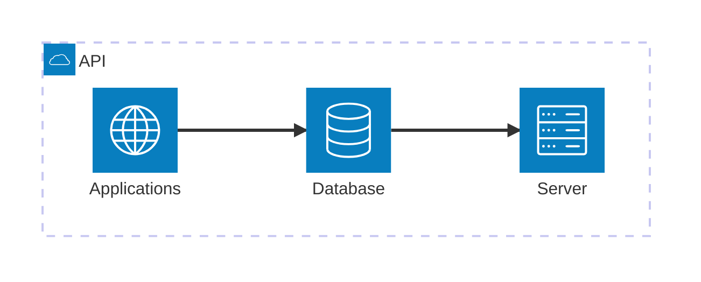
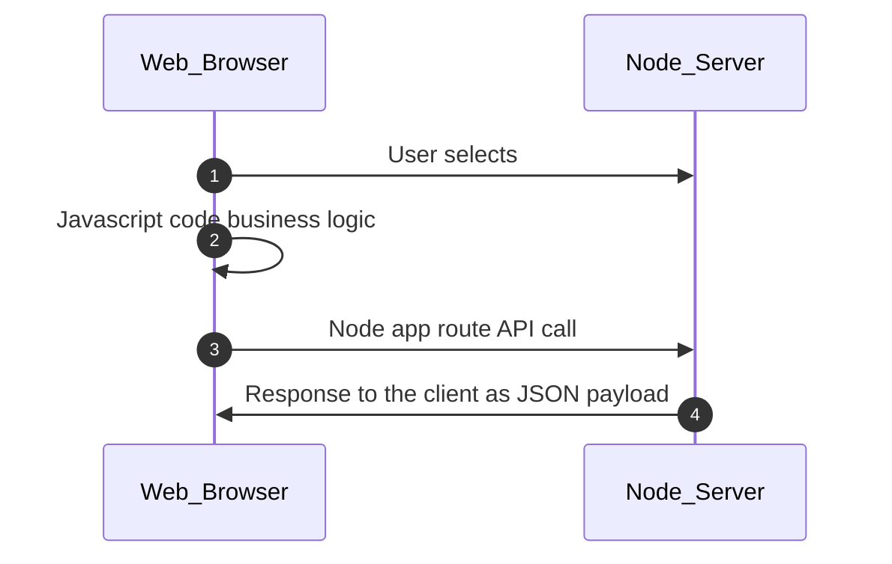

Node.js is a runtime environment that can run server-side JavaScript applications, 
while Express is a server-side JavaScript web framework that runs on top of Node.js 
in which to write your applications.

- learn about server-side development using JavaScript, 
- code your first web server, and 
- use Node Package Manager to manage your application modules and dependencies. 
- explore how to make applications run in a non-blocking manner by using asynchronous callbacks and promises, 
- learn how REST APIs are used in conjunction with HTTP requests and responses with the Express.js framework, and then, 
- practice using Express by building a web server and creating dynamic content with middleware, routing, and templating.

These are the types of servers:


Event-Driven, Asynchronous, Non-Blocking, Single-Threaded:

Server processes can be categorized as either "single-threaded" or "multi-threaded". 
In a single-threaded environment, only one command is processed at any given time, 
while in a multi-threaded environment, multiple commands can be processed simultaneously. 
Despite being single-threaded, Node.js excels in performance due to its asynchronous and non-blocking nature. 
This means that while a process is being executed, the program does not need to wait until it finishes. 
Node.js is event-driven, meaning that when it performs an input/output (I/O) operation, 
such as reading from the network or accessing a database or file system, an event is triggered. 
Instead of blocking the thread and consuming processor time while waiting, 
Node.js resumes operations when the response is received, or when the corresponding event occurs. 
This non-blocking behavior enables the server to remain responsive and handle multiple tasks concurrently, 
akin to a multi-threaded environment.

Node.js in the same components of the architecture where they use Java, Perl, C++, Python, and Ruby. 

Express.js is a highly configurable framework for building applications on Node.js. It abstracts lower-level APIs in Node.js by using HTTP utility methods and middleware. 

With server-side JavaScript, node applications process and route web service requests from the client. 
In Step 1, the user selects an option in the user interface written in HTML and CSS. 
In Step 2, this action by the user triggers JavaScript code that implements the business logic on the client-side, for example, input validation. 
In Step 3, the JavaScript application makes a web service call over HTTP with a JSON data payload. The REST web service, which is part of a Node.js application running on the Node server, receives the HTTP request. 
In Step 4, the REST web service processes the request and returns the result to the client as a JSON payload over HTTP.



Node and Express in the IDE:

```
\ NodeExpressApp
  |___\ github
  |___\ launchConfiguration
  |___\ public - (2) html/js/css/img/templates/views/public assets
  |___\ scripts
  |___\ server
  |    |___\ config
  |    |___\ controllers
  |    |___\ routes - (3) defines endpoints that accept and process client requests.
  |    |___. server.js - (1) express.js application code:`const app = express()` (2) server.js - a file which contains the main application code.
  |___\ test
  |___. package.json (4) contains metadata information about the project including dependencies
```

Express.js is a framework that helps you build Node.js applications. 


