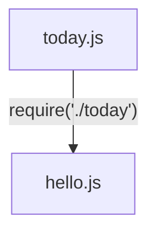
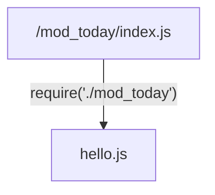

#### Table of Contents
1.   [Introduction](#introduction)
2.   [Require vs Import Usages](#require-vs-import-usages)
3.   [Server-Side Javascript](#server-side-javascript)
4.   [Create Web Server with Node.js](#create-web-server-with-nodejs)
5.   [Working with Node.js Modules](#working-with-nodejs-modules)


## Introduction
Node.js is a runtime environment that can run server-side JavaScript applications, 
while Express is a server-side JavaScript web framework that runs on top of Node.js 
in which to write your applications.

- learn about server-side development using JavaScript, 
- code your first web server, and 
- use Node Package Manager to manage your application modules and dependencies. 
- explore how to make applications run in a non-blocking manner by using asynchronous callbacks and promises, 
- learn how REST APIs are used in conjunction with HTTP requests and responses with the Express.js framework, and then, 
- practice using Express by building a web server and creating dynamic content with middleware, routing, and templating.

These are the types of servers:


Event-Driven, Asynchronous, Non-Blocking, Single-Threaded:

Server processes can be categorized as either "single-threaded" or "multi-threaded". 
In a single-threaded environment, only one command is processed at any given time, 
while in a multi-threaded environment, multiple commands can be processed simultaneously. 
Despite being single-threaded, Node.js excels in performance due to its asynchronous and non-blocking nature. 
This means that while a process is being executed, the program does not need to wait until it finishes. 
Node.js is event-driven, meaning that when it performs an input/output (I/O) operation, 
such as reading from the network or accessing a database or file system, an event is triggered. 
Instead of blocking the thread and consuming processor time while waiting, 
Node.js resumes operations when the response is received, or when the corresponding event occurs. 
This non-blocking behavior enables the server to remain responsive and handle multiple tasks concurrently, 
akin to a multi-threaded environment.

Node.js in the same components of the architecture where they use Java, Perl, C++, Python, and Ruby. 

Express.js is a highly configurable framework for building applications on Node.js. It abstracts lower-level APIs in Node.js by using HTTP utility methods and middleware. 

With server-side JavaScript, node applications process and route web service requests from the client. 
In Step 1, the user selects an option in the user interface written in HTML and CSS. 
In Step 2, this action by the user triggers JavaScript code that implements the business logic on the client-side, for example, input validation. 
In Step 3, the JavaScript application makes a web service call over HTTP with a JSON data payload. The REST web service, which is part of a Node.js application running on the Node server, receives the HTTP request. 
In Step 4, the REST web service processes the request and returns the result to the client as a JSON payload over HTTP.


Node and Express in the IDE:

```
\ NodeExpressApp
  |___\ github
  |___\ launchConfiguration
  |___\ public - (2) html/js/css/img/templates/views/public assets
  |___\ scripts
  |___\ server
  |    |___\ config
  |    |___\ controllers
  |    |___\ routes - (3) defines endpoints that accept and process client requests.
  |    |___. server.js - (1) express.js application code:`const app = express()` (2) server.js - a file which contains the main application code.
  |___\ test
  |___. package.json (4) contains metadata information about the project including dependencies
```

Express.js is a framework that helps you build Node.js applications. 


---

## Require vs Import Usages

explain what a module is, 
explain what a module specification is, 
explain the purpose of import and require statements, and 
differentiate between import and require statements. 

In Node.js, modules are files containing related, encapsulated JavaScript code that serve a specific purpose. 

**Modules** can be a single file or a collection of multiple files and folders. Developers rely heavily on modules because of their reusability as well as their ability to break down complex code into manageable chunks. 

When an external application needs to use the code contained in a module the application needs to call that module. When the external application calls a module, the module is called using an `import()` or a `require()` statement. 
Which statement is needed depends on the module specification. 

about module specifications:
A directory with one or more modules bundled together is called a package. Module specifications are the conventions and standards used to create packages in JavaScript code for Node.js applications.
The most commonly used module specifications for Node.js applications are:
1. CommonJS and
2. ES modules.

differences between CommonJS and ES modules. 
By default, Node.js treats JavaScript code as a CommonJS module. 
Library authors can easily enable ES modules in a Node.js package by simply changing the package file extension from dot j-s to dot m-j-s. 


CommonJS modules use the require() statement to import modules whereas ES modules use the import() function. When a module is needed outside of its own file it must be exported first. The module.exports statement should be used with CommonJS. Modules can be exported to an ES specification using the “export” keyword. 

|  | CommonJS | ES |
|:--------:|:--------:|:--------:|
| import a module | required() | import() |
| export from a module | module.exports | export |


Differences between require and import within the application code:
The require statement can be called anywhere in the file whereas 
the import statement must be called at the beginning of the file. Since the require statement can be called from anywhere, this means that it can be called within conditional statements and functions, but import cannot. This may sound like an advantage of require but note that the require statement is bound dynamically whereas import is bound statically. This means errors that occur when linking the function definition to the function call will not be identified until run-time. For Import, binding errors are identified at Compile time. Require modules are synchronous in nature and modules imported with import are asynchronous. Synchronous means the modules will be loaded and processed in a linear fashion, one at a time. 
Asynchronous means the modules can be processed simultaneously. Import runs faster compared to require functions in large-scale applications which involve loading hundreds of modules. 

| CommonJS | ES |
|:--------:|:--------:|
| can be called anywhere in the code | can be called at th beginning of the file |
| can be called within conditionals and functions | cannot be called within conditionals or functions |
| Dynamic | Static |
| Binding errors not identified until run-time | Binding errors identified at compile-time
| Synchronous | Asynchronous |


Sample code that shows how to export and import using require and import. Recall that the require statement is used with CommonJS applications. 

This code snippet will show how to export from a file named message dot j-s. We use module dot exports to export the string “Hello programmers” from the message dot j-s module. 
```javascript
//export from a file name message.js
module.exports = 'Hello Programmers';
```
Next, to import the message dot j-s module into the main application, we use the require statement. In this code the result of require is assigned to the let m-s-g, then the variable is logged in the console. 
```javascript
//import from the message.js file
let msg = require('./message.js');
console.log(msg);
```


Now, let’s look at code that exports an ES module from a file named module dot m-j-s. This code names a constant ‘a’ and sets the constant equal to 1. Next, the export statement is used. Note the use of the curly brackets. A is renamed to my value. 
```javascript
//import from file named module.mjs
const a = 1;
export { a as "myalue" };
```

Finally, we look at code to import an ES module using import. 
Simply use the import keyword. We are importing my value from the module.mjs file. 
```javascript
//import from  module.mjs
import { myvalue } from module.mjs;
```

In this video, you learned that a module is a file containing related JavaScript functions that serves a specific purpose. Module specifications are conventions and standards used to create packages in JavaScript code. import and require statements are used to call a module or a package into an external application. The require statement can be called from anywhere in the app code, is bound dynamically, and is synchronous, and the import statement can only be called at the beginning of a file, is bound statically, and is asynchronous. 


--

## Server-Side JavaScript

purpose of the Node.js JavaScript framework and 
differences between client-side JavaScript and server-side JavaScript. 

JavaScript is one of the main languages used in the World Wide Web. It was originally built to add dynamic behavior to static websites on clients where there were primarily browsers. JavaScript is an interpreted language. You do not need to compile JavaScript applications before running them. Although the language syntax resembles Java, it is not derived from the Java programming language. 
JavaScript can now be run on different servers and embedded systems and all modern web browsers support JavaScript. 

Developers build responsive, interactive web applications with 
* hypertext markup language (HTML),
* cascading style sheets (CSS), and
* JavaScript.

With a text editor and a web browser, you can quickly write, test, and debug JavaScript applications. 


With client-side JavaScript, developers create rich, interactive web applications in the web browser. In step 
1. the user interface is rendered using HTML and CSS.
2. When the user selects an option in the web page, it triggers business logic written as a JavaScript application.
3. The JavaScript application sends a web service request using JavaScript Object Notation (JSON) over hypertext transfer protocol (HTTP).
4. On the server, a Representational State Transfer (REST) web service intercepts the call. This service traditionally would be written in Java, PHP: Hypertext Preprocessor (PHP), or another backend language.
5. In the last step, the application server processes the web service request using a server-side application such as Enterprise Java components and returns to the client.


With server-side JavaScript, Node.js applications process, and route web service requests from the client. Compare the following diagram with the one in the previous slide. Most of the steps are identical. 
In step 1, the user selects an option in the user interface, which is written in HTML and CSS. 
In step 2, the option triggers a JavaScript application that implements the business logic on the client-side. 
In step 3, the JavaScript application makes a web service call over HTTP with a data payload written in JSON. 
In step 4, a REST web service intercepts the HTTP request and 
in the final step, instead of invoking an Enterprise Java application, the Node.js server hosts an application written in the JavaScript language. 


This code written in JavaScript runs on the server, and not in the client's web browser. In this video, you learned that: Node.js is a server-side programming framework that uses JavaScript as its programming language. With server-side JavaScript, Node.js applications process and route web service requests from the client and Node.js is for developers who want to build scalable, concurrent server applications quickly with a minimal set of tools. 


--

## Create Web Server with Node.js

Describe the characteristics of Node.js and 
write a simple web server with Node.js. 

Node.js is a server-side programming framework that uses JavaScript as its programming language. Many developers are already familiar with the JavaScript language. 
 - It is built with a heavy emphasis on concurrent programming with a lightweight language.
 - it is a single-threaded application environment that handles input/output (I/O) operations through events. 
 - write callback functions to handle results when they complete. Instead of blocking on asynchronous I/O operations.


Node.js is suited for developers who want to build **scalable** and **concurrent** server applications by using features like callback functions and the Node.JS runtime event loop. These features of the JavaScript language and the Node.js runtime _enable quick development with a minimal set of tools_. 

Every JavaScript file is a module in Node.js. 

A module corresponds to a script file. 

A package can contain one or more nodes. 

The Node.js runtime is packaged with many utility modules that you can use to create and extend your applications. With the HTTP Node.js module, you can develop an application that listens to HTTP requests and returns HTTP response messages. 

To create an instance of a web server, use the HTTP.createServer function. The web server is stored in a variable called "server." The createServer function takes in an optional callback function as a parameter. This callback function handles the incoming request message and provides an appropriate response message. The callback function shown here is anonymous. 
```javascript
let server = http.createServer(function(request, response) {
    let body = "Hello World!";
    response.writeHead(200, {
        'Content-Length':body.length,
        'Content-Type':'text/plain'
    });
    response.end(body);
});
server.listen(8080);
```
After you create an instance of the server object, you can set the server to listen to a specific port; for example, call the HTTP.listen function with a parameter of 8080 as the port to set the server to listen on 8080. 


- Node.js is a single-threaded application environment that handles I/O operations through events.
- Every JavaScript file is a module in Node.js.
- With the HTTP Node.js module, you can develop an application that listens to HTTP requests and returns HTTP response messages. 


---

## Working with Node.js Modules

- Describe Node.js packages.
- Import Node.js modules into your script.
- Export functions and properties from a module, and
- access exported properties from a module.

A package consists of one or more modules. The package.json file describes details about a Node.js module. If a module does not have a package.json file, Node.js assumes that the main class is named index.js. 
index.js
```json
{
    "name": "mod_today",
    "version": "1.0.0",
    "main": "./lib/today",
    "license": "Apache-2.0"
}
```

To specify a different main script for your module, specify a relative path to the Node.js script from the module directory. This is an example of a package.json file. The name and version fields form a unique identifier for the module; for example, today-1.0.0. The main field lists a path to the main Node.js script; in this example, the today.js script in the lib subdirectory. Package.json defines many other fields. For example, license states the module's usage rights. 


You can use the require function to import a Node.js module. The require statement assumes that scripts have a file extension of .js. The require function creates an object that represents the imported Node.js module. In this example, a Node,js script file that is named today.js is in the same directory as your application. When you call require with the name of a subdirectory, Node.js looks for a script file with the same name as the subdirectory. If the script file does not exist, the function assumes that the name is the name of a directory and looks for a script named index.js within that directory. 
```javascript
let today = require('./today');
```


To import a Node.js module that consists of a single script, use the require function with a relative path to the script file. In this example, the main application is in the Node.js script file. Hello.js makes a require function call to the today.js script file. 


This example uses the same hello.js Node.js file. The Node.js module is saved in a directory named mod_today. The actual script file is saved in index.js. When hello.js makes a call to the require function in the mod_today directory, the script file checks whether there is a file named index.js. This is the default name for a script in a Node.js module. 


Each Node.js module has an implicit exports object. 
To make a function or a value available to Node.js applications that import your module, add a property to exports. In this example, the dayOfWeek property is added to the exports object. Then, dayOfWeek is assigned an anonymous function that returns the day of the week. For example, if the dayOfWeek function returns 1, this value maps to Monday. 
index.js
```javascript
let date = new Date();

let days = ['Monday', 'Tuesday', 'Wednesday', 'Thursday', 'Friday', 'Saturday'];

exports.dayOfWeek = function () {
    returns days[date.getDay() - 1];
};
```

When you import a Node.js module, the require function returns a JavaScript object that represents an instance of the module. For example, the today variable is an instance of the today Node.js module that is called "today." 
```javascript
let today = require('./mod_today');
```

To access the properties of the module, retrieve the property from the variable. 
In the same example, today.dayOfWeek represents the current exported property from the today Node.js module. 
```javascript
console.log("Happy %s!", today.dayOfWeek() );
```


In this video, you learned that: Every package has a package.json file that describes details about a Node.js module. To make a function or a value available to Node.js applications that import your module, add a property to the implicit exports object and when you import a Node.js module, the require function returns a JavaScript object that represents an instance of the module. 
