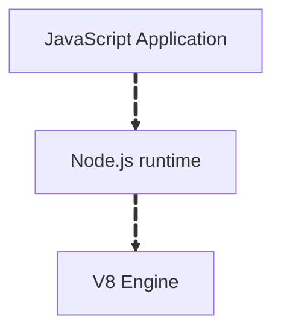
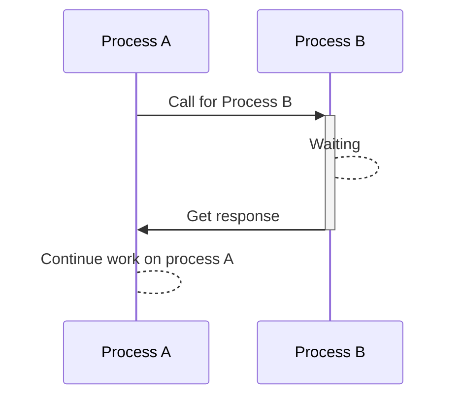
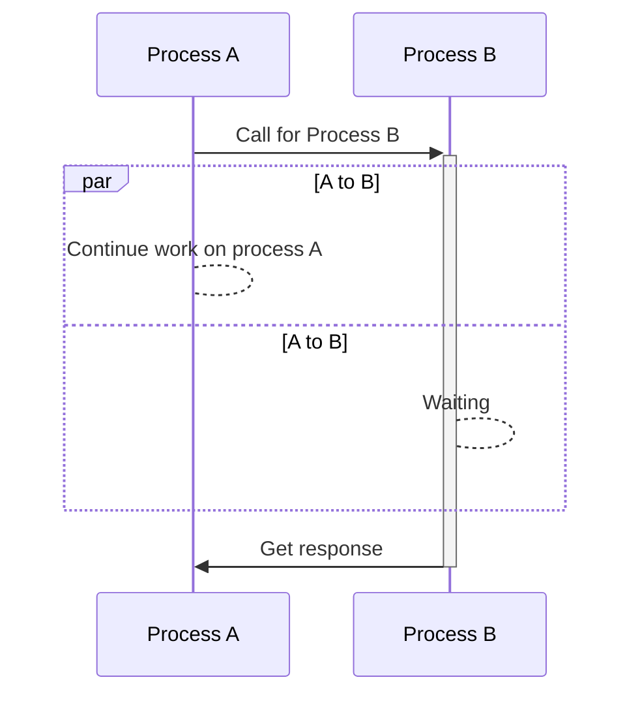
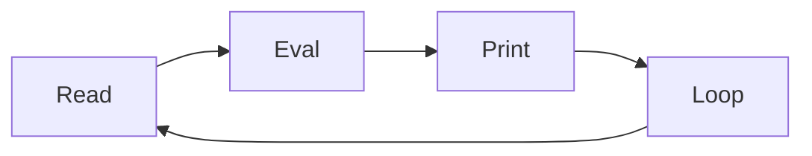

## Table of Contents
1. [Introduction to Node.js](#introduction-to-nodejs)
   - [What is Node.js](#what-is-nodejs)
   - [The Node.js stack](#the-nodejs-stack)
2. [Node.js architecture](#nodejs-architecture)
   - [Synchronous Execution](#synchronous-execution)
   - [Asynchronous Execution](#asynchronous-execution)
3. [Why use Node.js?](#why-use-nodejs)
4. [Running Node.js and Writing Basic Scripts](#running-nodejs-and-writing-basic-scripts)
   - [Running a script with the node command](#running-a-script-with-the-node-command)

## Introduction to Node.js
Get introduced to Node.js, its primary use cases, and the core features that make it powerful for back-end development.
Node.js, one of the most versatile and popular technologies for back-end development. 
Node.js allows us to use JavaScript, a language you may already know from front-end work, 
on the server side as well. This opens up a whole new world of possibilities. 
Let’s explore why Node.js is so well-suited for modern web applications.
### What is Node.js?
Node.js is an open-source, cross-platform runtime environment that allows us to execute JavaScript code outside a web browser. 
Traditionally, JavaScript was used exclusively in browsers to create interactive web pages. 
Node.js changed this by enabling JavaScript to be run on servers as well.
At its core, Node.js is built on the V8 JavaScript engine, which powers Google Chrome. 
V8 compiles JavaScript into machine code, making it fast and efficient. 
Node.js takes this powerful engine and surrounds it with additional capabilities to perform tasks that browsers don’t handle, 
such as:
- Handling HTTP requests: Like responding to web clients (browsers) when they access a website.
- Interacting with file systems: Reading from or writing to files on a server.
- Communicating with databases: Fetching or storing data for web applications.
- Building APIs: Creating interfaces that other programs or services can use.
Essentially, Node.js transforms JavaScript from a browser-only language into a versatile,
full-stack development tool that powers both the frontend and backend.
### The Node.js stack

---

## Node.js architecture
Node.js is built on a unique approach to handling tasks, which makes it both efficient and scalable. 
At its core, Node.js runs JavaScript on a single thread, meaning it processes all tasks using one main execution line. 
However, this doesn’t mean that it’s limited to handling one thing at a time. 
Node.js achieves high performance through its event loop and asynchronous, non-blocking I/O.

Here’s how it works: When Node.js encounters a task that takes time—like reading a file, 
making a database query, or waiting for a network response—it doesn’t stop and wait for the task to complete. 
Instead, it hands off the time-consuming task to the operating system or an internal thread pool to handle in the background. 
Once the task is finished, Node.js is notified, and the event loop picks up the result for further processing.

This design allows Node.js to handle many tasks simultaneously without creating multiple threads for each request, making it lightweight and efficient. 
For applications like web servers or APIs, where many requests involve reading files or querying databases, 
this architecture enables Node.js to handle thousands of users at once without slowing down.

### Synchronous Execution

In synchronous execution, each task must finish before the next one begins, leading to a sequential, blocking flow

Whereas 
### ASynchronous Execution

By combining JavaScript’s simplicity with a powerful event-driven architecture, 
Node.js provides developers with an efficient way to build scalable and responsive applications.

### Why use Node.js?
Node.js is especially well-suited for certain types of applications due to its efficiency and scalability:
- Real-time applications: Node.js is ideal for chat apps or multiplayer games, 
where handling many simultaneous connections is crucial. 
Its ability to process multiple requests without waiting for each one to complete allows it to handle real-time data effectively.
- I/O-heavy applications: Applications that involve heavy input/output tasks,
such as reading/writing files, interacting with databases,
or handling network requests, benefit greatly from Node.js’s non-blocking nature.
It allows multiple tasks to be processed concurrently, making the application more responsive.
- APIs for single-page applications (SPAs): Node.js is perfect for developing back-end APIs for SPAs. 
Since both frontend and backend can be written in JavaScript, 
it simplifies development and creates a unified environment for developers.

---

## Running Node.js and Writing Basic Scripts
Learn to run Node.js, use the Node REPL, and execute your first script.
Node.js is a runtime environment, which means it doesn’t come with a graphical user interface like some other development tools. 
We interact with Node.js through a command-line interface (CLI). run Node.js, 
use its interactive environment (REPL), and create a basic script. 
Once we’re comfortable with this, we’ll have taken our first steps into server-side JavaScript.

Running Node.js in interactive mode (REPL)
The Node.js REPL lets us interact with JavaScript directly. 
REPL stands for Read-Eval-Print Loop:
Read: It reads the input.
Eval: It evaluates the input as JavaScript code.
Print: It prints the result of the evaluation.
Loop: It waits for the next command.

Using the REPL is a quick way to test ideas, debug code, or try out JavaScript features.

REPL workflow

To start the Node.js REPL, type node in the terminal and press "Enter". 
This launches an interactive environment where you can type JavaScript code and see the results immediately. 
The REPL is excellent for testing quick JavaScript snippets without creating a file. 
However, to save and reuse code, we usually write scripts.

To run a script in Node.js, we use the node command followed by the name of the script file. 
For example:
`node <scriptname>.js`
This command tells Node.js to load and execute the code inside scriptname.js.

