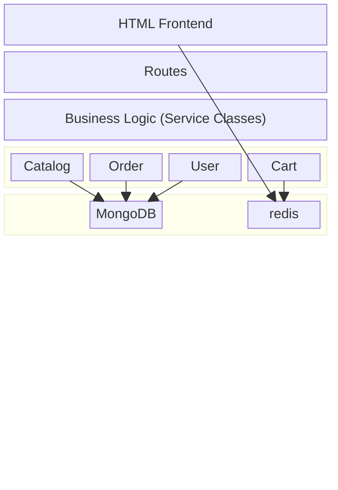
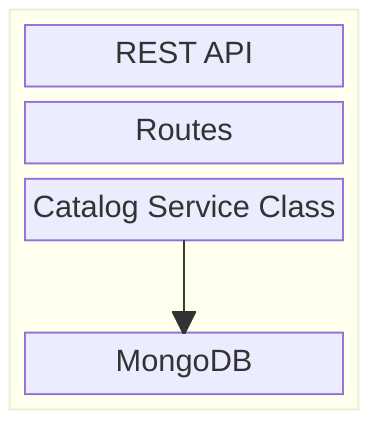

#### Table of Contents
0. [Introduction](#introduction)
1. [Prepare Your Development Environment](#prepare-your-development-environment)
     - [Installing Git, Node.js, and Docker](#installing-git-nodejs-and-docker)
     - [Getting the exercise files from GitHub](#getting-the-exercise-files-from-github)
     - [Setting up Visual Studio Code, ESLint, and Prettier](#setting-up-visual-studio-code-eslint-and-prettier)
     - [Launching MongoDB, Redis, and Jaeger in Docker](#launching-mongodb-redis-and-jaeger-in-docker)
     - [Installing MongoDB Compass](#installing-mongodb-compass)
2. [Planning Your Miscroservice Migration](#planning-your-miscroservice-migration)
     - [Setting up and exploring your sample application](#setting-up-and-exploring-your-sample-application)
     - [Understanding the sample apps code](#understanding-the-sample-apps-code)
     - [Getting insights with OpenTelemetry and Jaeger](#getting-insights-with-opentelemetry-and-jaeger)
     - [Mission Summary](#mission-summary)
3. [Your First Service: The Catalog Service](#your-first-service-the-catalog-service)

## Introduction

These courses will provide you with all the fundamentals you need. 
To get the most out of this course, make sure you know JavaScript including 
* variables,
* functions and
* callbacks.

You'll also need to be familiar with the ES6 syntax, like 
* classes,
* error functions,
* spread syntax, and
* objective structuring since they'll popup throughout the videos.

Plus, understanding __promises__ and __async__ await is important. 
When it comes to Node.js, you should know how to install modules using npm and 
how to start an application. 
You also need a good handle on __Express__ and how __HTTP__ works. 
It will be super helpful if you have a basic understanding of __REST__ and __REST APIs__.

--


## Prepare Your Development Environment

### Installing Git, Node.js, and Docker
setting up your development environment. See it, like a checklist to make sure you won't get stuck later. 
So first of all, of course, we need 
1. Node.js - recommend installing the current LTS, means long-term supported version that you see here on the nodejs.org website.
2. Git - Then you will also need a Git client on your system to acquire the exercise files from GitHub. And you see when you go to git-scm.com that you will be presented with selections for your particular operating system.
3. Docker - As we will also use MongoDB and Redis and we will use Docker to run them. You will need to have Docker installed on your system. Here again, go to the respective website, this is docker.com and download the respective installation files for your system. Once you have installed all of that on your system, you can check it in your console or terminal by running `node -v`, `docker -v`, and `git -v`. Maybe the versions you see are different, but if the output looks somewhat like this, you are all set.

Changed Directory:
`L0gN3/4-api/linkedin-learning-node-microservices`

--

### Getting the exercise files from GitHub
To download all the files to get started, you have to clone this Git repository and 
I will show you now how you can fetch all the branches. 
So I'm now in my system terminal and there in the desktop folder, you can choose freely where on your system you want the exercise files to live. 
I will now create new folder node-microservices and then I will change into this folder. 
Cloning a repository with all its branches is not as easy as one might think. 

First you have to type `git clone --bare` and now I'm pasting in the github URL: git@github.com:LinkedInLearning/nodejs-microservices-4403064.git 
and then I add blank end .git So that's important. It has to end on blank .git, 
`git clone --bare git@github.com:LinkedInLearning/nodejs-microservices-4403064.git .git`
and then I hit Return. 
let's break down the command git clone --bare git@github.com:LinkedInLearning/nodejs-microservices-4403064.git .git:
* `git clone --bare`: This command creates a bare repository. A bare repository does not have a working directory and is typically used as a remote repository for sharing.
* `git@github.com:LinkedInLearning/nodejs-microservices-4403064.git`: This is the URL of the Git repository you want to clone.
* `.git`: This specifies the directory where the bare repository will be created. In this case, it's named .git.
So, this command clones the specified Git repository as a bare repository into a directory named `.git` on your local machine.
> [!WARNING]
> Urgent info that needs immediate user attention to avoid problems.
> ```
> git clone --bare git@github.com:LinkedInLearning/nodejs-microservices-4403064.git .git
> Cloning into bare repository '.git'...
> The authenticity of host 'github.com (140.82.113.3)' can't be established.
> ED25519 key fingerprint is SHA256:+DiY3wvvV6TuJJhbpZisF/zLDA0zPMSvHdkr4UvCOqU.
> This key is not known by any other names.
> Are you sure you want to continue connecting (yes/no/[fingerprint])? yes
> Warning: Permanently added 'github.com' (ED25519) to the list of known hosts.
> git@github.com: Permission denied (publickey).
> fatal: Could not read from remote repository.
> 
> Please make sure you have the correct access rights
> and the repository exists.
> aj@AJs-MacBook-Pro linkedin-learning-node-microservices % git clone --bare > https://github.com/LinkedInLearning/nodejs-microservices-4403064.git .git
> Cloning into bare repository '.git'...
> ```


> [!TIP]
> Helpful advice for doing things better or more easily.
> Quick options to get unstuck Easiest (no SSH keys): clone over HTTPS
> ```
> git clone --bare https://github.com/LinkedInLearning/nodejs-microservices-4403064.git .git
> ```
> Alternative fix is to Fix SSH (recommended if you want passwordless clones)


Next I type `git config --bool core.bare false`. If this all looks rather akin to you, don't worry for me as well, but this is how it's done. 
The command `git config --bool core.bare false` sets the core.bare configuration option to false for your Git repository. 
This means the repository is no longer treated as a bare repository and will have a working directory. 
Essentially, it converts a bare repository into a standard repository with a working directory where you can edit files.

Next I type `git reset --hard` and then I type `git branch`. Now you see it's a lot of branches are coming down and that's it. 
The command `git reset --hard` is used in Git to reset your current branch to a specific state, discarding all changes in the working directory and staging area. This means that any uncommitted changes will be lost, and the branch will be set to the last commit or a specified commit. It's a powerful command that should be used with caution, as it can lead to loss of work if not used properly.
The command `git branch` is used in Git to manage branches within a repository. It allows you to create, list, rename, and delete branches. Branches are essential for developing features or fixing bugs in isolation from the main codebase, enabling multiple developers to work on different tasks simultaneously without interfering with each other's work.

Now we have downloaded all the branches of all the exercise files. I will show you later how to switch between these branches but this is way easier in Visual Studio Code.

--

### Setting up Visual Studio Code, ESLint, and Prettier
will be using __Visual Studio Code__ as my IDE. It's free and it comes with great Node.js support out of the box. I highly recommend that you use it as well at least for this course.

After installing it, you can open it right away and it'll present you with a welcome screen. I will now go ahead and we'll just open the exercise file folder that we downloaded from GitHub before. So I go to File, Open Folder, and on my desktop, I find node microservices and I will just open it. Visual Studio Code also comes with an integrated terminal that will open right away ⌃⇧`. 

For that I go to View, Terminal and you see it's basically, a regular system terminal that lets me execute Command (indistinct) and it's important for instance to run NPM install. The sample project we will be working on, comes with a configuration for ESLint and Prettier. 
- __ESLint__ checks your code for errors as you type while Prettier can reformat your code to match some code conventions. There is a Visual Studio code extension for ESLint. You can install it by clicking on the Extensions icon on the left menu bar. So I click here and there. I then look for ESLint and I will just install the first that comes up.
- Next, I will also install __Prettier ESLint__. You see it here on my list. I just type it in for you for, in case it does not show up right away. Prettier ESLint and here also I click on Install. Now I can go back to my explorer and you already see that I have a vscode directory here and there I have a settings JSON. And this settings JSON, contains settings that are needed for Prettier ESLint to work properly. What you also see in Visual Studio Code is here on the bottom left, this main branch symbol, and when I click on it, you see all the different branches that I have here and this you can use to basically switch between those branches. So now I'm on branch 05_06B but now let me switch back to Main. That's the main branch that we will be using when we get started. Also, while we work together on this course, you will see that I will be on different branch names. Just ignore that you stay on Main with Visual Studio Code now up and running, we are now ready to install a few more things that we'll need throughout this course.

--

### Launching MongoDB, Redis, and Jaeger in Docker
Previously we installed Docker and we will now use Docker to install a few more third party applications that we will use. And to make this a little bit more easy for you I have prepared those Docker commands for you already. You find them in resources, support, and there is a file snippets.md. And if you scroll down a little bit, you see the commands for getting MongoDB. MongoDB is a NoSQL database and we will first run docker pull mongo. 

_Start MongoDB in Docker_
Run `docker pull mongo` when doing it the first time followed by `docker run --name mongodb -p 37017:27017 -d mongo`.

_Start Redis in Docker_
Run `docker pull redis` followed by `docker run --name redis -p 7379:6379 -d redis`

Then I also want to install and run Jaeger. 
So Jaeger is a observability tool and I will cover that a little bit later. For now, we will just copy this long command that we have here and paste it into the console and it'll also automatically now pull Jaeger so you don't have to pull before. Usually it does it automatically. And just to check if Jaeger is working I will quickly just follow this link.

_Start Jaeger in Docker_
```sh
docker run --name jaeger \
  -e COLLECTOR_OTLP_ENABLED=true \
  -p 16686:16686 \
  -p 4317:4317 \
  -p 4318:4318 \
  -d jaegertracing/all-in-one:1.45
```

So I'm clicking on CMD and click on this link and you'll see the UI of Jaeger popping up.
UI: http://localhost:16686

_Start RabbitMQ in Docker_
`docker run -it --rm --name rabbitmq -p 5672:5672 -p 15672:15672 -d rabbitmq:3.11-management`

Management interface: http://localhost:15672/ user: guest, password: guest

 Next, I want to also install Redis Commander. Redis Commander is a tool that you can use to look into Redis. So I just copied the npm install line for Redis Commander but we have to run it with sudo because we are installing globally. So I add sudo, that's now just a MAC thing. If you're on Windows, you don't have to do this. You don't have a sudo, but I have to do it. So sudo npm install -g Redis Commander and it asks for my password.
 
_Install and run Redis Commander_
Make sure you have installed it with `npm install -g redis-commander` then run `redis-commander --redis-port=7379`.
```
redis-commander --redis-port=7379
Starting with NODE_ENV=undefined and config NODE_APP_INSTANCE=undefined
Using scan instead of keys
No Save: false
listening on 0.0.0.0:8081
access with browser at http://127.0.0.1:8081
Redis Connection localhost:7379 using Redis DB #0
loading keys by prefix ""
found 0 keys for "" on node 0 (localhost:7379)
```

  And then we can start it right away with copying this line. And it will now listen on local host 8081. I will open this URL real quick and you'll see this gives me insights into my running Redis application. Right now, it does not tell me much because I have no Redis data created at this point. We will not use Redis Commander within this course but if at some point you're curious what is actually stored in the database, feel free to fire up Redis Commander and have a look. 
  
  
  During this course it might well be that you start your computer and this would mean that your Docker containers won't be running anymore. So make sure that every time you restart your computer or when you see you get an error on the console that it cannot connect, then head to Docker Desktop. I can do this by simply clicking on this whale symbol here and open the dashboard. And there you see all the different Docker containers that are running at this point and you can click on this run icon to run them. So don't forget this. It's really important that MongoDB, Redis, and Jaeger are at least running throughout this course.


---

### Installing MongoDB Compass
We need to install one more thing, and that's MongoDB Compass. MongoDB Compass is one UI for MongoDB, and we will just need it once during this course. But again, like with Redis-Commander, it might help you to look at the data at some point to see what's going on under the hood. So please, search for MongoDB Compass, and then when you end up on this page, just download and install it, and then we can run it already. So I opened it already, and when I started, I'm presented with a connection screen. And the only thing you have to know is that our MongoDB listens on 37017, so not 27. So I changed that, and then I click Connect. And we are now connected to this MongoDB instance running in Docker. And right now, you don't see much, but the system collections. But as soon as we start our sample application the shopper collection will show up here.


---

## Planning Your Miscroservice Migration

### Setting up and exploring your sample application
Here’s a clean, simplified, and GitHub-friendly version of your paragraph, rewritten for clarity and learning notes. I’ve broken it into short sections, used plain language, and kept it easy to scan in Markdown.

#### Sample Application Setup
We will start by setting up a sample application that we’ll use throughout the course.

#### Project Structure
When you look at the project directory, you’ll see the following folders:
- resources
Contains helper files that will be referenced later in the course.
- workspace
This is where we will do most of our development work.
- microservices
Currently empty.
- shopper
The main Node.js application we will run.

#### Installing Dependencies
1. Navigate into the application:
`cd workspace/shopper`

2. Install dependencies:
`npm install`

The package.json file includes many dependencies, such as:
* Redis client
* MongoDB
* OpenTelemetry

#### Running the Application
This project uses __NodeMon__, a tool that automatically restarts the application when files change.
This is very useful during development because you don’t need to manually restart the server.

To start the app:
`npm run dev`


If everything is working, you should see logs indicating:
* Connected to Redis
* Connected to MongoDB
* Server listening on port 3000

#### Viewing the App in the Browser
Open your browser and go to:
`http://localhost:3000`

You’ll see a very simple shopping application:
* An empty shopping page
* Login functionality
* User management (for development purposes only)

#### Creating an Admin User
To use the app properly, we need to create an admin user.
1. Create a user (example):
   - Email: test@test.com
   - Password: your choice
2. Check Set as admin
3. Submit the form

> [!NOTE]
> Useful information that users should know, even when skimming content.
> In a real application, user management would not be publicly accessible.
> This exists only to make development easier.


#### Logging In 
After creating the user:
1. Log in using the same email and password

2. New menu items will appear:
     - Manage Items
     - Manage Orders

At this point, the shop is empty — so let’s add some items.

#### Adding Sample Items (MongoDB)
1. Open MongoDB Compass
2. Click Refresh
3. Open the dropper database
4. Go to the items collection
5. Click Add Data → Import JSON or CSV
     Select the file located at:
     `resources/support/items.json`
6. Click Import
You should now see 15 items added to the database.

#### Using the Shop
* Refresh the shop page
* You’ll now see a basic list of items (simple but functional)
* You can:
     - Add items to your cart
     - Open the cart from the menu bar
     - Click Buy Now to place an order

After placing an order:
* Go to Manage Orders
* You’ll see the new order
* Click Set Shipped to update its status

--

### Understanding the sample apps code
In the previous video we looked at the shop application from a user perspective, and now let's dig into the code a little bit. So let's go simply through the file system. So first of all, I have this client directory, nothing much in there but a style sheet. 
Then we have the server directory, and there you find the `bin`, `start.js script`, which is used to start the Express server. 
```
node-microservice
|_> _Resources
|_> .github
|_> .vscode
|_v workspace
  |_> microservices
  |_v shoppers
    |_> client/ css
    |_> node_modules
    |_> server
      |_v bin
         * start.js
      |_> config
      |_> lib
      |_> models
      |_> routes
      |_> services
      |_> views
      * app.js
    * .eslintrc.json
    * .gitignore
    * prettierrc


```


And you should understand pretty much everything in there because it's really just about starting an Express application. I just point out the few things that might be different. The first thing starts with line 10 where we configure tracing, and then we'll talk about this later in more detail, 
linkedin-learning-node-microservices/workspace/shopper/server/bin/start.js:10
```javascript
// eslint-disable-next-line no-unused-vars
const tracing = require("../lib/tracing")(
  `${config.serviceName}:${config.serviceVersion}`
);
```
but know that the shop application and all the other services that we will add come with tracing built in. And this is tracing using OpenTelemetry. And OpenTelemetry is a library for tracing that lets us later then use Jaeger to look at how services are communicating with each other. So this comes out of the box, you don't have to understand each detail, but I will show you how this looks like in the next video then. Everything else pretty normal. 


Then we have two helper functions that do the connection to Mongoose and the connection to Redis. 
linkedin-learning-node-microservices/workspace/shopper/server/bin/start.js:16-17
```javascript
const connectToMongoose = require("../lib/mongooseConnection"); // Function to connect to MongoDB
const connectToRedis = require("../lib/redisConnection"); // Function to connect to Redis
```
You can look into this, always when you just want to drill into something you can click on Command or Control, then follow this link that Visual Studio code gives you, then we configure the Redis client, and the maybe most interesting part is down here starting line 41, 
linkedin-learning-node-microservices/workspace/shopper/server/bin/start.js:40-43
```javascript
// Connect to Redis and MongoDB before starting the server
config.redis.client.connect().then(() => {
  connectToMongoose(config.mongodb.url).then(() => server.listen(port));
});
```
because here make sure that we first connect to Redis, and then connect to Mongoose, and only then we call server.listen to actually start the Express server. I do this because Redis and Mongoose are prerequisites. If the connection fails here, then it does not make any sense to start the server. So this is why it is like that. You will see the same pattern later then when we create those services. 


Next let's head into app.js, and let's scroll through it. So this is a very regular setup for an Express application. Maybe, most notable, we are _using Redis as a session store_, so by now if you look into this Redis command, you should already see the sessions being stored there. And if we scroll a little bit down here in line 47, 
workspace/shopper/server/app.js:
```javascript
// Middleware to add 'global' template variables
app.use(assignTemplateVariables);
```
that's maybe also interesting, we are assigning the template variables there. So let's head into this. 

This is a middleware, and this middleware reads the user ID from the session, so when I login the user ID is stored into the session. And here in the middleware we'll use the local UserService class to fetch this user and assign it also to res.local, which makes it available to our templates. 
workspace/shopper/server/lib/middlewares.js:13-29
```javascript
  // Fetch user and cart info if user is logged in
  if (req.session.userId) {
    try {
      res.locals.currentUser = await UserService.getOne(req.session.userId);
      const { userId } = req.session;

```

Additionally, now that we know the user down here, we also load the shopping cart. So what you saw before when you see the shopping cart's count in the menu bar, this data is all fetched here. 
workspace/shopper/server/lib/middlewares.js:18-25
```javascript
      let cartCount = 0;
      const cartContents = await CartService.getAll(userId);
      if (cartContents) {
        Object.keys(cartContents).forEach((itemId) => {
          cartCount += parseInt(cartContents[itemId], 10);
        });
      }
      res.locals.cartCount = cartCount;

```


Back into app.js, let's close the middleware, then we set up the routes, and this is done by route handlers, 
workspace/shopper/server/app.js
```javascript
// Set up routes
app.use("/", routeHandler);
```


so let's drill into that. So in routes, index.js, we use the Express Router module to set up all the routes that this application has. 
workspace/shopper/server/app.js:13-14
```javascript
// Initialize express application
const app = express();

```


And you see here it renders the index page, but we can look into, for instance, shop, index.js, and there you see we have the CatalogService, and the CartService, and we are calling CatalogService.getAll, and then render the list with the items. 
workspace/shopper/server/routes/shop/index.js:1-23
```javascript
// Required modules and services are imported
const express = require("express");
const CatalogService = require("../../services/CatalogService");
const CartService = require("../../services/CartService");

// Express router is instantiated
const router = express.Router();

// Route to render all items in the catalog
router.get("/", async (req, res) => {
  try {
    // Get all items from the catalog
    const items = await CatalogService.getAll();
    // Render the 'shop' view and pass in the items
    res.render("shop", { items });
  } catch (err) {
    req.session.messages.push({
      type: "danger",
      text: "There was an error loading the shop catalog."
    });
    console.error(err);
  }
});

```

So if you know Express, this should look very familiar to you. One important part now is this CatalogService, let's drilled into that, or in general all those services. So in this application I am using this pattern where you call all the classes that deal with data service classes. And that's the reason why this CatalogService is called like that. So this CatalogService is not a microservice, it's just a service class.
workspace/shopper/server/routes/shop/index.js:13
```javascript
/**
 * Service class for interacting with the Item catalog
 */
class CatalogService {
  /**
   * Get all items from the database, sorted in descending order by creation time
   * @returns {Promise<Array>} - A promise that resolves to an array of Items
   */
  static async getAll() {
    return ItemModel.find({}).sort({ createdAt: -1 }).exec();
  }

  /**
   * Get a single item from the database
   * @param {string} itemId - The id of the item to retrieve
   * @returns {Promise<Object>} - A promise that resolves to an Item object
   */
  static async getOne(itemId) {
    return ItemModel.findById(itemId).exec();
  }

  /**
   * Create a new item in the database
   * @param {Object} data - The data for the new item
   * @returns {Promise<Object>} - A promise that resolves to the new Item object
   */
  static async create(data) {
    const item = new ItemModel(data);
    return item.save();
  }

  /**
   * Update an existing item in the database
   * @param {string} itemId - The id of the item to update
   * @param {Object} data - The new data for the item
   * @returns {Promise<Object|null>} - A promise that resolves to the updated Item object, or null if no item was found
   */
  static async update(itemId, data) {
    return ItemModel.findByIdAndUpdate(itemId, data, { new: true }).exec();
  }

  /**
   * Remove an item from the database
   * @param {string} itemId - The id of the item to remove
   * @returns {Promise<Object>} - A promise that resolves to the deletion result
   */
  static async remove(itemId) {
    return ItemModel.deleteOne({ _id: itemId }).exec();
  }
}

```

And it has all the methods that connect to the database. For instance, getAll, this will fetch all the items from the database or get one which fetches one item. 
workspace/shopper/server/services/CatalogService.js:9
```javascript
/**
 * Service class for interacting with the Item catalog
 */
class CatalogService {
  /**
   * Get all items from the database, sorted in descending order by creation time
   * @returns {Promise<Array>} - A promise that resolves to an array of Items
   */
  static async getAll() {
    return ItemModel.find({}).sort({ createdAt: -1 }).exec();
  }

  /**
   * Get a single item from the database
   * @param {string} itemId - The id of the item to retrieve
   * @returns {Promise<Object>} - A promise that resolves to an Item object
   */
  static async getOne(itemId) {
    return ItemModel.findById(itemId).exec();
  }

  /**
   * Create a new item in the database
   * @param {Object} data - The data for the new item
   * @returns {Promise<Object>} - A promise that resolves to the new Item object
   */
  static async create(data) {
    const item = new ItemModel(data);
    return item.save();
  }

  /**
   * Update an existing item in the database
   * @param {string} itemId - The id of the item to update
   * @param {Object} data - The new data for the item
   * @returns {Promise<Object|null>} - A promise that resolves to the updated Item object, or null if no item was found
   */
  static async update(itemId, data) {
    return ItemModel.findByIdAndUpdate(itemId, data, { new: true }).exec();
  }

  /**
   * Remove an item from the database
   * @param {string} itemId - The id of the item to remove
   * @returns {Promise<Object>} - A promise that resolves to the deletion result
   */
  static async remove(itemId) {
    return ItemModel.deleteOne({ _id: itemId }).exec();
  }
}

```

And we also have classes for the cart, which uses Redis as a backend. 
Let's have a quick look into that. So here you see that we are using Redis commands, HINCRBY, for instance, when we add something to the cart.
workspace/shopper/server/services/CartService.js:
```javascript
  /**
   * Add an item to the user's cart
   * @param {string} itemId - The ID of the item to add
   * @returns {Promise<number>} - A promise that resolves to the new quantity of
   * the item in the cart
   */
  static async add(userId, itemId) {
    return this.client().HINCRBY(this.key(userId), itemId, 1);
  }

```

One more important thing is, and you see that in the CatalogService up here, we are loading the Item model, and this indicates that we are using Mongoose here. 
workspace/shopper/server/services/CatalogService.js:3-4
```javascript
// Import the Item model from mongoose
const ItemModel = require("../models/Item");
```

So Mongoose is a database abstraction that we are using here and it connects to MongoDB, and just makes it a little bit easier to deal with the data that's stored in MongoDB.
workspace/shopper/server/models/Item.js:1
```javascript
const mongoose = require('mongoose');
```

These are the basic building blocks of our shop application. Everything in there follows pretty much the same schema. Feel free to browse a little bit more through the code, and I will also explain important pieces of it when we need it as we go through the course.

## Getting insights with OpenTelemetry and Jaeger

#### Observability with OpenTelemetry & Jaeger
The shop application already includes distributed tracing using OpenTelemetry, and this setup will also be used for all services we create throughout the course.

#### What Is OpenTelemetry?
OpenTelemetry is an open-source project under the Cloud Native Computing Foundation (CNCF).
It provides:
- APIs
- Libraries
- Agents
- Instrumentation
These tools make observability a built-in feature of cloud-native applications.
Observability focuses on understanding:
- Application performance
- Application health
- How requests move through the system
One of OpenTelemetry’s core features is tracing.

#### What Is Jaeger?
Jaeger is also a CNCF project.
It is a distributed tracing system that helps troubleshoot latency and performance issues in service-oriented architectures.

In simple terms:
Jaeger acts like a detective that tracks every step of a request to help you understand what slows your application down.

#### Jaeger UI
The Jaeger UI is available at:
`http://localhost:16686`
Jaeger was installed earlier using Docker. Because tracing is already enabled:
* The shopper service appears in the service list
* Traces are already being collected
Click Find Traces to view recorded requests.

#### Understanding a Trace
When you inspect a trace (for example, a GET / request):
 - You can see each step involved in handling the request
 - Each step shows how long it took
Examples:
 - Session middleware: ~2 ms
 - Redis GET call: ~1 ms
This gives you a clear view of where time is spent during a request.

#### Known Limitation
MongoDB calls do not appear in the traces yet.
This is because the required MongoDB instrumentation plugin has not been installed.
Even so, the traces already provide valuable insight into how the application behaves.

#### Scaling with Microservices
As we add more services:
 - The system architecture view in Jaeger will grow
 - Service-to-service connections will become visible
 - Traces will show how requests flow across multiple services
This becomes especially useful in a microservices architecture.

#### Simple Mental Model (Factory Analogy)
Think of your application as a factory:
 - Each machine = a service
 - The product = a complete request (e.g., loading a webpage)
How tracing works:
 - OpenTelemetry places a “camera” in each machine (service)
 - Each camera records what the machine does (traces)
 - Jaeger collects all recordings
 - The Jaeger UI lets you replay and inspect them
This helps you quickly identify:
 - Delays
 - Bottlenecks
 - Errors

#### What to Do During the Course
As we continue building more services:
 - Periodically open Jaeger
 - Inspect traces
 - Observe how services interact
This habit will help you better understand distributed systems and performance issues.

--

## Mission Summary
Before breaking the monolithic shop application into microservices, it’s important to understand why we’re doing it.
Microservices are not a silver bullet. While they offer real benefits, they can also add complexity if used incorrectly. This course focuses on using them intentionally and practically.

#### Our Two Core Goals
1. Improve Scalability
     - Monolithic applications are difficult to scale.
     - Microservices allow individual components to scale independently.
     - Multiple instances of the same service can run at once, enabling load balancing.

2. Improve Maintainability
     - Services can be developed, deployed, and maintained independently.
     - Different teams can work on different services.
     - Multiple versions of a service can exist at the same time through proper versioning and deployment strategies.
With these goals defined, we’re ready to move from concepts to implementation and begin working with the code in the next chapter.

--


What's your goal for this chapter?
Selecting transcript lines in this section will navigate to timestamp in the video
Before we get started, let's first understand what we will accomplish in this first chapter. This is our application as it is right now. We have an HTML Front End. These are the rendered views we see in the browser. Then we have a set of routes. These routes, at this point, represent the different URLs a user can access like /shop. I didn't write out all the routes here and just use this box here as a placeholder. Below that, we have the business logic. This logic is today in so-called service classes for catalog, order, user, and cart. We saw them before when we looked through the application. The service classes for catalog, order, and user use MongoDB as its backend to store the data and cart uses Redis. And also for the sake of completeness, I will omit this from now on. The front end also uses Redis as a session store, but we won't touch this functionality. Back to the service classes, they make it rather easy for us to find a good way to split out functionality as there is pretty much a one-to-one mapping between the service class and what will later be a standalone microservice. 


In real life applications, it can be more complicated to find the boundaries within the business logic. The goal is now to create one service that can replace a piece of business logic from the main application, and that shows the catalog that handles all catalog related operations. It provides access to all the items in the shop and also lets us edit and delete them. 


The catalog service itself is also nothing else but an express application. It also comes with a set of routes and some service class that talks to the database. These routes represent a so-called REST API. This is the HTTP interface that other applications can use to talk to our service. As REST APIs are so important and often misunderstood, we will spend a full video to quickly cover the fundamentals while we design the REST API for our first service. But before we do that, let's quickly create the express application that will become our catalog microservice.

