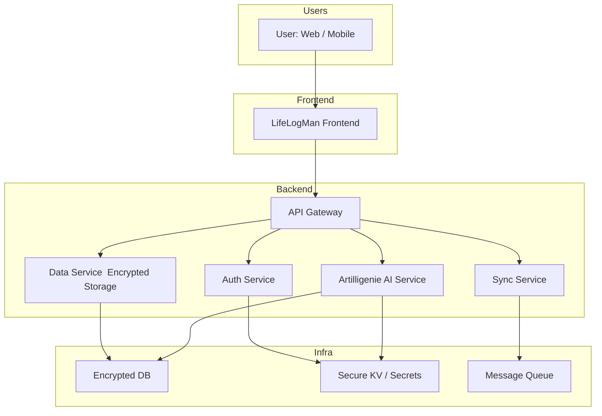
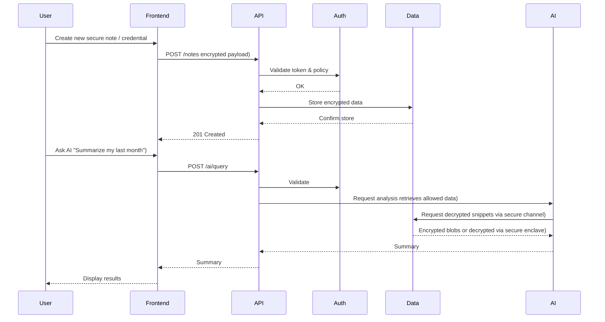
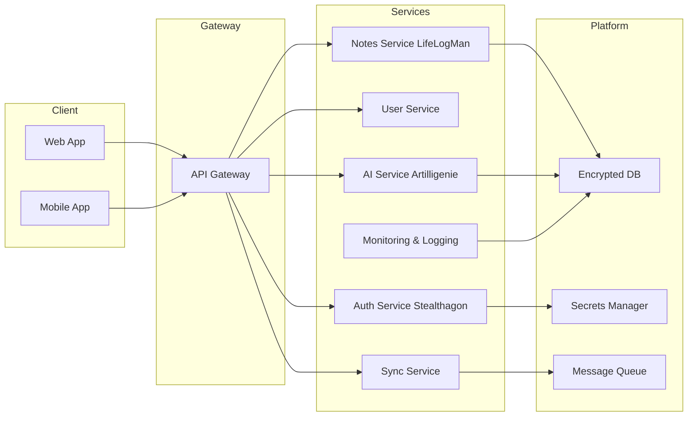

# L⊘gN3 🔐

## Pronounciation
Log - /lôɡ,läɡ/
Entry - /ˈentrē/

## Meaning of Abbreviation
__L__ ayered-security with __0__ Zero-trust __G__ ateKeeper following __N__ IST framework and __3__ CIA Triad principles.
The project is mainly data security first approach.

## Description
mini scratch simple personal project that focus on range of web, mobile, data security, ai. implementation with modern tech-stacks  front-end, back-end, api, database, etc.). Covers broad focus on architecture and holistic engineering process. Forme, myself, This will maybe my forever project. Under this project are also a notes from the learning platforms and this repo might serve to be a playground, a multi purpose repo, where I store all my study notes, make this an active learning note-taking, and apply hands-on experimentations, even certifications. A place where I can stack all what I learn could be any kind of project. A project hobby.

## User Requirements and ~~Business~~ Project Goals
A user will be able to login and log into his life log app. This app targets the end users log whether it is for personal notes, action required check list, time management like timeline  static content), time box  interactive),  keeping passwords in a safe place like a securing it in vault, and also targets health care data like high blood pressure hypertension logging, or sugar level glucose monitoring, daily intake of maintenance medicine  notification). As well as logging personal budgets and expenses tracking. It helps the user to secure and protect his sensitive data, help monitor health, and help track finances. These are the  3) main temples of this life log app. And building more templates.

---
# System design and Architecture 

## Establish Scope
List of follow up Questions?
1. What are specific Features?
- app: lifelog - notes - highblood pressure logs - sugar level logs - password keeper - and many more templates
- sec: encrypt/decrypt - masking - tokenization options for sensitive data  password keeper)
- ai: animation button - train on test data - ml - nlp
- ai: mascot called "archintel" 
- theme can change into dark theme / light theme / constrast + AODA  color blind)
- template: countdown timer / day timer  notification) / action required checklist + notif + unchecked  how old is the item left undone, display created. notification-level controls delete, done, view)
- template: itenirary/tour/trip planner + leeway + notification
- template: table sheet  listing, drag&drop items, highlight row or column) it has filter/sort feature a-z/0-9 
- template: carnet notebook  routine, daily sheets, weekly, monthly sheet, goals, budget planner, expenses tracker,
- template: a student may want to practice exam and quizzes. a template in mind that can input question and answer, format would be multiple choices  a,b,c,d) or a identification exam.
Notes: 
A _quiz_ is a short, informal assessment of a specific, recent topic, while a _test_ is a more comprehensive and formal evaluation of a larger unit or chapter. An _exam_ is the most formal and significant assessment, typically covering all or a major portion of the course material for a final grade. Essentially, it’s a hierarchy of formality and scope, with quiz < test < exam. 
- Technologies in mind: react  web/mobile), sprint boot  backend), rust  security), ai  python), analytics  vue.js), cloud infra  aws/gcp)

2. How many users?
3. What are the anticipated scales in 1 month, 3 or 6 months?
4. What are the company technology stack?

## Frame high-lvl blueprint system design
LifeLogMan is the main application responsible for logging, storing, and organizing data across backend, frontend, and mobile platforms. Stealthagon serves as the cybersecurity engine, applying protection mechanisms to safeguard sensitive information at every layer. Artilligenie is an AI‑focused application, independently designed yet fully integrated, that generates intelligent outputs and insights based on user data.
### Architecture  Mermaid)
Key components in box diagram

### Workflow  Sequence Diagram)

### Microservices Layout  Component Diagram)

2. How large the problem space?

## Delve Deeper into Details
1. deep dive into system components  eg. hash fuction, reduce latency..)
2. Focus on bottlenecks & resource estimation

## Recap / Refinements
1. Bottlenecks 
2. Potential Improvements
3. Errors cases  server failure, network logs)
4. Monitor metrics
5. Next scale curve

