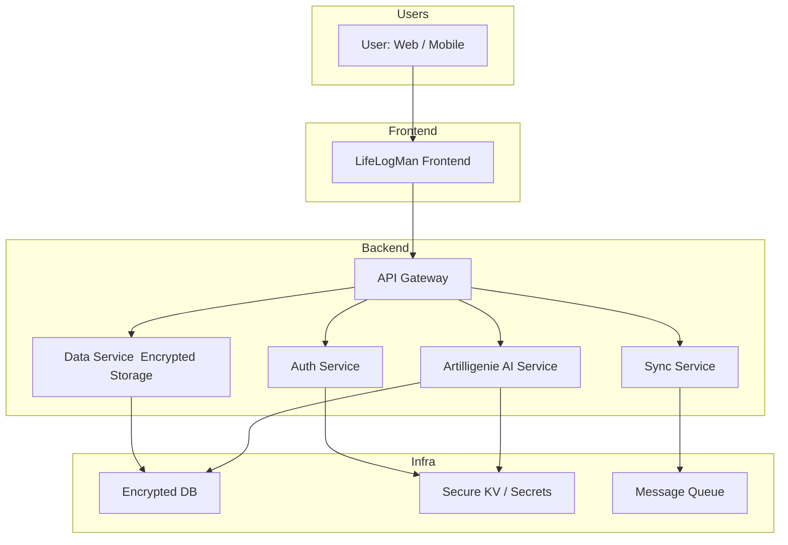
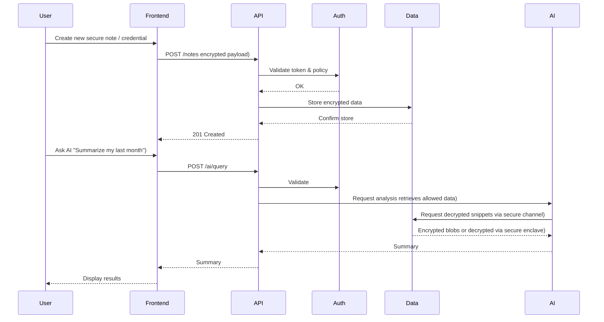
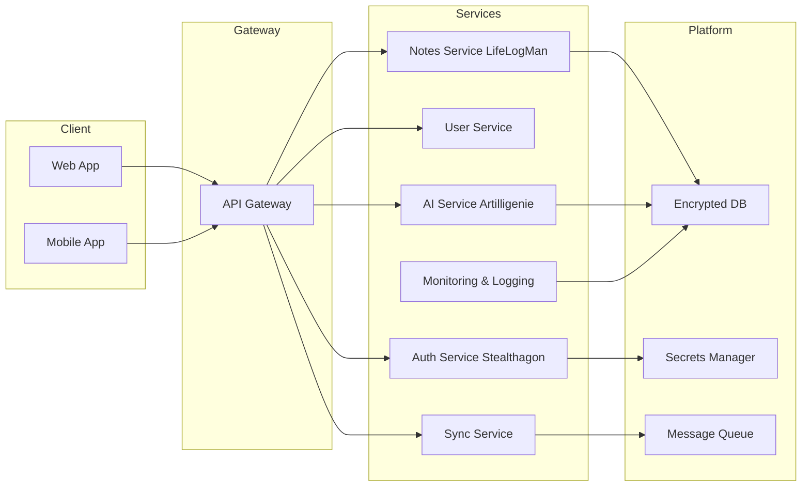

# L⊘gN3 🔐

## Pronounciation
Log - /lôɡ,läɡ/
Entry - /ˈentrē/

## Meaning of Abbreviation
__L__ ayered-security with __0__ Zero-trust __G__ ateKeeper following __N__ IST framework and __3__ CIA Triad principles. For initial thought branding.
The project is mainly proposed on data security first approach + AI powered system.


# L0gN3

> **Life. Zero. Guarded. Neural. Three.**  
> A unified ecosystem for **secure life data, intelligent systems, and privacy-first architecture**.

---

## 🧠 What is L0gN3?

**L0gN3** is a personal engineering ecosystem designed to combine:

- 🔐 **Cybersecurity-first architecture**
- 🧠 **AI-powered intelligence**
- 📘 **Life data logging and analytics**

It represents a **trinity of systems** working together:

1. **LifeLogMan** → Personal life logging platform  
2. **Stealthagon** → Data protection & security engine  
3. **Artilligenie** → AI intelligence layer  

---

## 🔤 Meaning Behind L.0.g.N.3.

L0gN3 is not just a name — it is a **multi-layered architecture concept**.

Each letter adapts its meaning depending on the system it represents.

---

# 🧩 The L0gN3 Trinity

---

## 📘 1. LifeLogMan — Personal Intelligence System

> A secure platform to log, analyze, and understand life events.

### Meaning

- **L** — Life  
- **0** — Zero Loss  
- **g** — Growth  
- **N** — Narrative  
- **3** — Mind • Memory • Meaning  

### Philosophy

Capture life as structured data and transform it into meaningful insights.

### Tagline

> *Life. Zero-loss. Growing Narrative. 3 dimensions of personal intelligence.*

---

## 🔐 2. Stealthagon — Security & Data Protection Engine

> A cybersecurity-first system focused on protecting sensitive data at scale.

### Meaning

- **L** — Locked  
- **0** — Zero Trust  
- **g** — Guarded  
- **N** — Network Shield  
- **3** — Encrypt • Tokenize • Isolate  

### Philosophy

Security is not a feature — it is the foundation.

### Tagline

> *Locked. Zero-trust. Guarded Network. 3 layers of digital defense.*

---

## 🧞 3. Artilligenie — AI Intelligence Layer

> A generative AI system that enables intelligent insights and automation.

### Meaning

- **L** — Learning  
- **0** — Zero Bias *(aspirational)*  
- **g** — Generative  
- **N** — Neural  
- **3** — Think • Predict • Create  

### Philosophy

AI should enhance human intelligence, not replace it.

### Tagline

> *Learning. Generative. Neural intelligence in 3 dimensions.*

---

# 🔗 Unified Architecture

| Component       | Role                          | Focus Area            |
|----------------|-------------------------------|-----------------------|
| LifeLogMan     | Data capture & insights       | Personal data         |
| Stealthagon    | Security & protection         | Cybersecurity         |
| Artilligenie   | AI & intelligence             | Machine learning / AI |

Together, they form:

> **A secure, intelligent, and extensible life system.**

---

# 🏗️ Vision

L0gN3 aims to become:

- A **personal operating system for life data**
- A **security-first microservices ecosystem**
- A **foundation for AI-assisted decision making**

---

# ⚙️ Engineering Principles

- 🔐 **Security First (Zero Trust)**
- 📦 **Modular Microservices Architecture**
- 🔄 **Scalable & Cloud-Native Design**
- 🧠 **AI-Integrated Workflows**
- 📊 **Data as a Core Asset**

---

# 🚀 Future Direction

- API-driven integration across all systems  
- AI-powered life insights & recommendations  
- Advanced encryption & tokenization pipelines  
- Real-time data processing & analytics  
- Personal knowledge graph & memory system  

---

# 👤 Author

Built by an engineer passionate about:

- Cybersecurity  
- Distributed systems  
- AI and intelligent platforms  
- Real-world scalable architecture  

---

> **L0gN3 is not just a project.  
It is a system of thinking.**


---

# 🏗️ Architecture (C4 Model)

L0gN3 follows a **C4 Model approach** to describe the system at multiple levels of abstraction.

---

## 🌍 Level 1 — System Context

L0gN3 is a unified platform connecting **users, secure systems, and AI intelligence**.
[ User ]
    |
    v
[ L0gN3 Platform ]
    |
    +--> LifeLogMan (Life Data)
    +--> Stealthagon (Security Layer)
    +--> Artilligenie (AI Layer)

### Description

- **User** interacts with the system via web/mobile interfaces  
- **LifeLogMan** captures and manages life data  
- **Stealthagon** ensures all data is protected  
- **Artilligenie** provides insights, predictions, and automation  

---

## 🧩 Level 2 — Container Diagram

Each major system is separated into independently scalable services.
```plain
                +----------------------+
                |      Frontend        |
                |   (React / UI App)   |
                +----------+-----------+
                           |
                           v
                +----------------------+
                |   API Gateway / BFF  |
                |    (Node.js Layer)   |
                +----------+-----------+
                           |
     ---------------------------------------------------------
     |                         |                             |
     v                         v                             v

+------------+        +----------------+           +------------------+
| LifeLogMan |        |  Stealthagon   |           |  Artilligenie    |
| (Spring)   |        | (Security Svc) |           |   (AI Services)  |
+------------+        +----------------+           +------------------+
     |                         |                             |
     v                         v                             v

+------------+        +----------------+           +------------------+
| PostgreSQL |        | Key Vault /    |           | Vector DB /      |
| / Storage  |        | Tokenization   |           | ML Models        |
+------------+        +----------------+           +------------------+
```


### Containers

- **Frontend (React)** → User interaction layer  
- **BFF / API Gateway (Node.js)** → Aggregates APIs and handles orchestration  
- **LifeLogMan (Spring Boot)** → Core business logic for life data  
- **Stealthagon** → Encryption, tokenization, security enforcement  
- **Artilligenie** → AI/ML processing and insights  

---

## 🔧 Level 3 — Component Diagram (Example: LifeLogMan)
[ LifeLogMan Service ]

    +----------------------+
    |  Controller Layer    |
    |  (REST APIs)         |
    +----------+-----------+
               |
               v
    +----------------------+
    |  Service Layer       |
    |  (Business Logic)    |
    +----------+-----------+
               |
               v
    +----------------------+
    |  Security Adapter    |
    | (Stealthagon API)    |
    +----------+-----------+
               |
               v
    +----------------------+
    | Repository Layer     |
    | (JPA / JDBC)         |
    +----------+-----------+
               |
               v
    +----------------------+
    |   Database           |
    +----------------------+


### Key Concepts

- All sensitive data passes through **Stealthagon** before persistence  
- APIs are designed using **REST + OpenAPI contracts**  
- Services are **stateless and horizontally scalable**

---

## 🔐 Cross-Cutting Concerns

These apply across all systems:

- **Authentication & Authorization** → OAuth2 / JWT  
- **Encryption** → Field-level + transport-level  
- **Observability** → Logs, metrics, tracing  
- **Error Handling** → Standardized API responses  
- **Resilience** → Retry, circuit breakers, graceful degradation  

---

## 🔄 Data Flow (Simplified)
User → Frontend → BFF → LifeLogMan  
                          ↓  
                    Stealthagon (Encrypt)  
                          ↓  
                      Database  

AI Flow:
LifeLogMan → Artilligenie → Insights → Frontend


---

## 🚀 Architectural Principles

- 🔐 Security-first (Zero Trust Architecture)  
- 🧩 Modular microservices design  
- 📈 Horizontally scalable systems  
- 🔄 Event-driven extensibility (future Kafka integration)  
- 🧠 AI as a first-class component  

---

> This architecture is designed to evolve from a personal platform into a **production-grade, distributed intelligent system**.
---

## Description
mini scratch simple personal project that focus on range of web, mobile, data security, ai. implementation with modern tech-stacks  front-end, back-end, api, database, etc.). Covers broad focus on architecture and holistic engineering process. Forme, myself, This will maybe my forever project. Under this project are also a notes from the learning platforms and this repo might serve to be a playground, a multi purpose repo, where I store all my study notes, make this an active learning note-taking, and apply hands-on experimentations, even certifications. A place where I can stack all what I learn could be any kind of project. A project hobby.


## User Requirements and ~~Business~~ Project Goals
A user will be able to login and log into his life log app. This app targets the end users log whether it is for personal notes, action required check list, time management like timeline  static content), time box  interactive),  keeping passwords in a safe place like a securing it in vault, and also targets health care data like high blood pressure hypertension logging, or sugar level glucose monitoring, daily intake of maintenance medicine  notification). As well as logging personal budgets and expenses tracking. It helps the user to secure and protect his sensitive data, help monitor health, and help track finances. These are the  3) main temples of this life log app. And building more templates.

---
# System design and Architecture 

## Establish Scope
List of follow up Questions?
1. What are specific Features?
- app: lifelog - notes - highblood pressure logs - sugar level logs - password keeper - and many more templates
- sec: encrypt/decrypt - masking - tokenization options for sensitive data  password keeper)
- ai: animation button - train on test data - ml - nlp
- ai: mascot called "archintel" 
- theme can change into dark theme / light theme / constrast + AODA  color blind)
- template: countdown timer / day timer  notification) / action required checklist + notif + unchecked  how old is the item left undone, display created. notification-level controls delete, done, view)
- template: itenirary/tour/trip planner + leeway + notification
- template: table sheet  listing, drag&drop items, highlight row or column) it has filter/sort feature a-z/0-9 
- template: carnet notebook  routine, daily sheets, weekly, monthly sheet, goals, budget planner, expenses tracker,
- template: a student may want to practice exam and quizzes. a template in mind that can input question and answer, format would be multiple choices  a,b,c,d) or a identification exam.
Notes: 
A _quiz_ is a short, informal assessment of a specific, recent topic, while a _test_ is a more comprehensive and formal evaluation of a larger unit or chapter. An _exam_ is the most formal and significant assessment, typically covering all or a major portion of the course material for a final grade. Essentially, it’s a hierarchy of formality and scope, with quiz < test < exam. 
- Technologies in mind: react  web/mobile), sprint boot  backend), rust  security), ai  python), analytics  vue.js), cloud infra  aws/gcp)

2. How many users?
3. What are the anticipated scales in 1 month, 3 or 6 months?
4. What are the company technology stack?

## Frame high-lvl blueprint system design
LifeLogMan is the main application responsible for logging, storing, and organizing data across backend, frontend, and mobile platforms. Stealthagon serves as the cybersecurity engine, applying protection mechanisms to safeguard sensitive information at every layer. Artilligenie is an AI‑focused application, independently designed yet fully integrated, that generates intelligent outputs and insights based on user data.
### Architecture  Mermaid)
Key components in box diagram

```mermaid
flowchart TD
  subgraph Users
    U[User: Web / Mobile]
  end

  subgraph Frontend
    FE[LifeLogMan Frontend]
  end

  subgraph Backend
    API[API Gateway]
    Auth[Auth Service]
    Data[Data Service  Encrypted Storage]
    AI[Artilligenie  AI Service]
    Sync[Sync Service]
  end

  subgraph Infra
    DB[Encrypted DB]
    KV[Secure KV / Secrets]
    MQ[Message Queue]
  end

  U --> FE
  FE --> API
  API --> Auth
  API --> Data
  API --> AI
  API --> Sync
  Auth --> KV
  Data --> DB
  Sync --> MQ
  AI --> DB
  AI --> KV
```
### Workflow  Sequence Diagram)

```mermaid
sequenceDiagram
  participant User
  participant Frontend
  participant API
  participant Auth
  participant Data
  participant AI

  User->>Frontend: Create new secure note / credential
  Frontend->>API: POST /notes  encrypted payload)
  API->>Auth: Validate token & policy
  Auth-->>API: OK
  API->>Data: Store encrypted data
  Data-->>API: Confirm store
  API-->>Frontend: 201 Created

  User->>Frontend: Ask AI  "Summarize my last month")
  Frontend->>API: POST /ai/query
  API->>Auth: Validate
  API->>AI: Request analysis  retrieves allowed data)
  AI->>Data: Request decrypted snippets  via secure channel)
  Data-->>AI: Encrypted blobs  or decrypted via secure enclave)
  AI-->>API: Summary
  API-->>Frontend: Summary
  Frontend-->>User: Display results
```
### Microservices Layout  Component Diagram)

```mermaid
graph LR
  subgraph Client
    A[Web App]
    B[Mobile App]
  end

  subgraph Gateway
    G[API Gateway]
  end

  subgraph Services
    S1[Auth Service Stealthagon]
    S2[User Service]
    S3[Notes Service LifeLogMan]
    S4[Sync Service]
    S5[AI Service Artilligenie]
    S6[Monitoring & Logging]
  end

  subgraph Platform
    DB[Encrypted DB]
    KV[Secrets Manager]
    MQ[Message Queue]
  end

  A --> G
  B --> G
  G --> S1
  G --> S2
  G --> S3
  G --> S4
  G --> S5
  S1 --> KV
  S3 --> DB
  S4 --> MQ
  S5 --> DB
  S6 --> DB
```


2. How large the problem space?

## Delve Deeper into Details
1. deep dive into system components  eg. hash fuction, reduce latency..)
2. Focus on bottlenecks & resource estimation

## Recap / Refinements
1. Bottlenecks 
2. Potential Improvements
3. Errors cases  server failure, network logs)
4. Monitor metrics
5. Next scale curve

